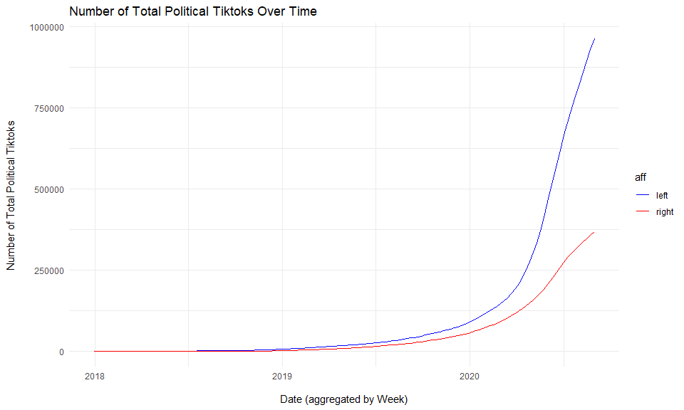
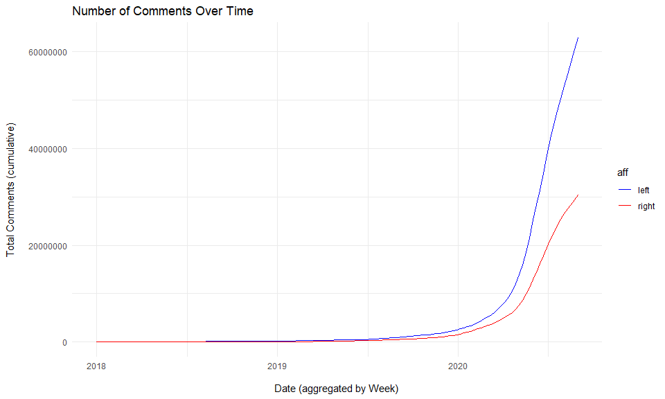
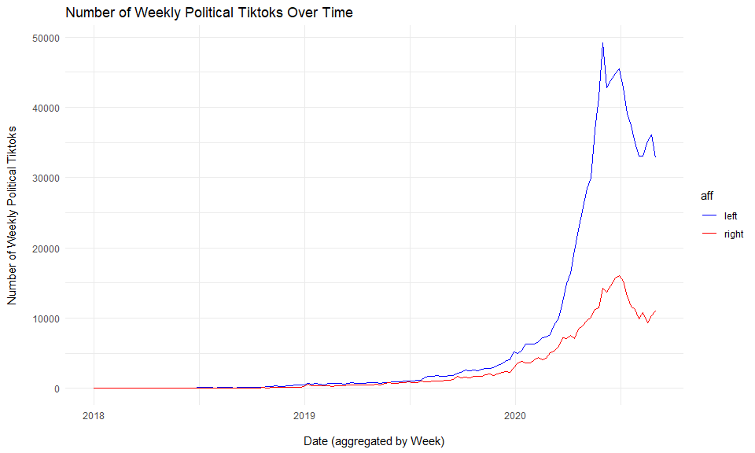
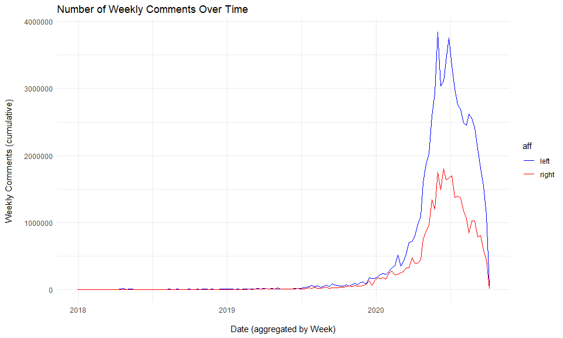
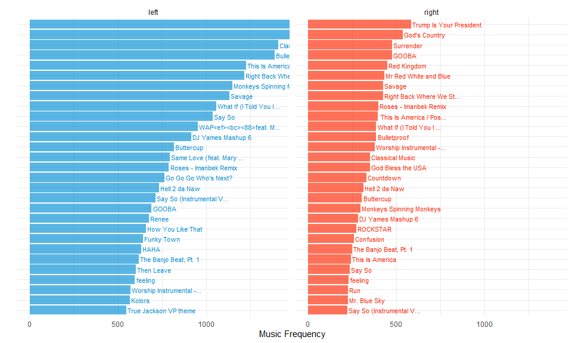
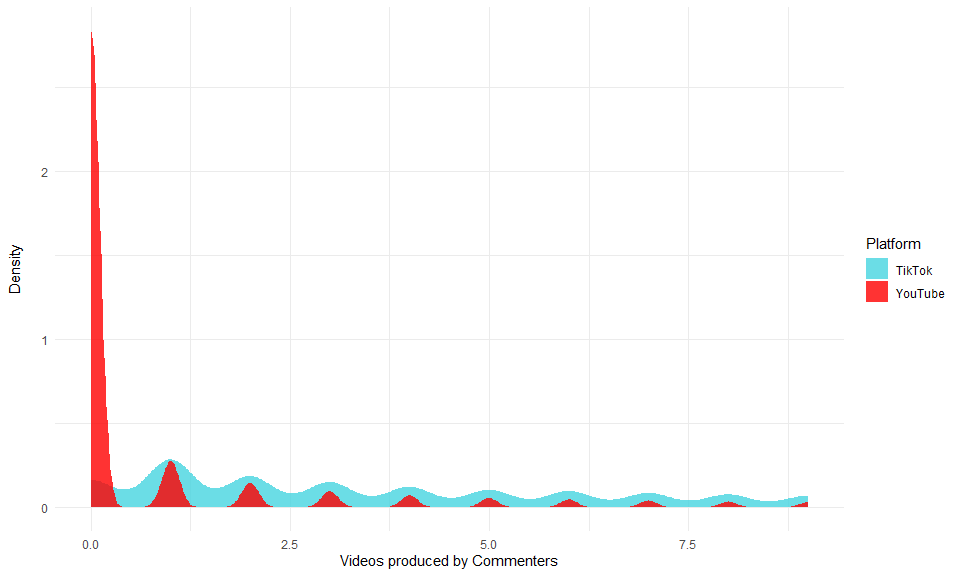
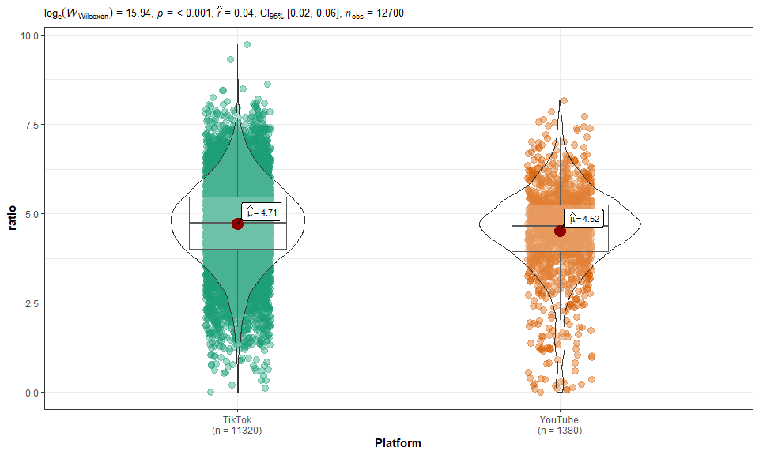
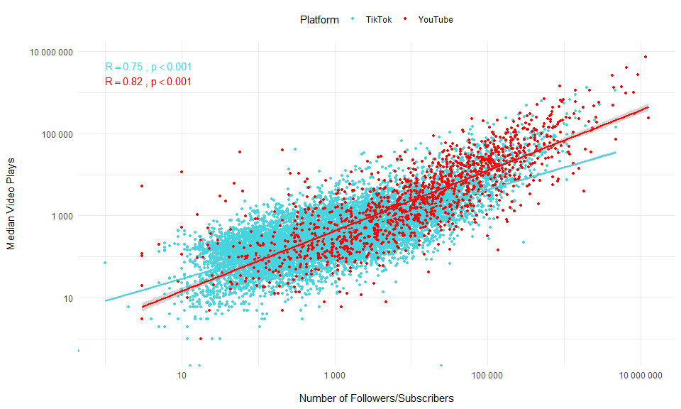
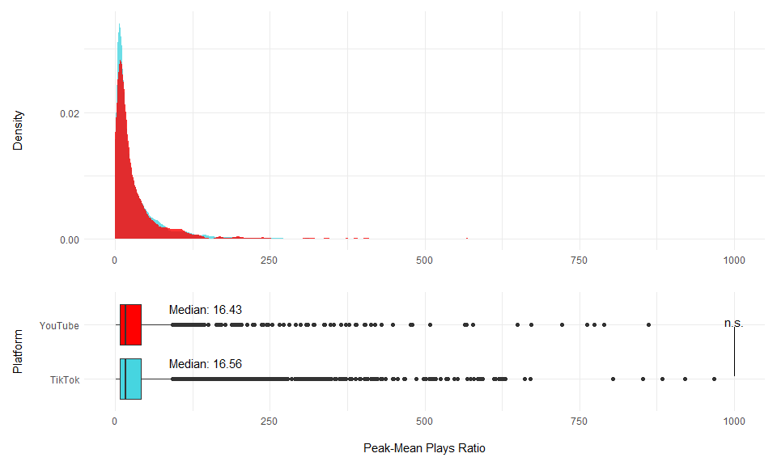
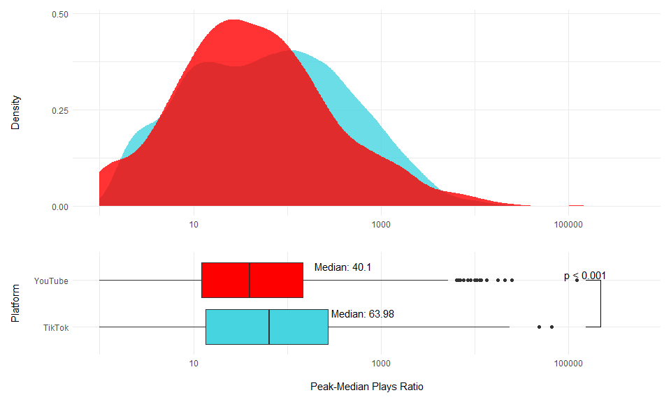

<!-- README.md is generated from README.Rmd. Please edit that file -->

This repo presents the data analysis of the paper…

# Data

``` r
pol <- read_rds(here::here("data/pol_db.rds"))

non_political <- read_rds("data/non_political.rds")

tk_dat <- pol  %>% 
  anti_join(non_political %>% rename(user_unique_id = user_id)) %>% 
  group_by(user_unique_id) %>%
  # filter(mean(political, na.rm = T) > .9) %>%
  mutate(total_play = sum(n_play, na.rm = T), 
         most_popular = max(n_play, na.rm = T),
         mean_play = mean(n_play, na.rm = T), 
         median_play = median(n_play, na.rm = T),
         sd_play = sd(n_play, na.rm = T),
         gini_views = DescTools::Gini(n_play)) %>%
  ungroup %>% 
  mutate(Platform = "TikTok") %>% 
  glimpse
#> Joining, by = "user_unique_id"
#> Warning: Problem with `mutate()` input `most_popular`.
#> x no non-missing arguments to max; returning -Inf
#> i Input `most_popular` is `max(n_play, na.rm = T)`.
#> i The error occurred in group 4852: user_unique_id = "theliberalrobloxer".
#> Warning in max(n_play, na.rm = T): no non-missing arguments to max; returning -
#> Inf
#> Warning: Problem with `mutate()` input `most_popular`.
#> x no non-missing arguments to max; returning -Inf
#> i Input `most_popular` is `max(n_play, na.rm = T)`.
#> i The error occurred in group 5495: user_unique_id = NA.
#> Warning in max(n_play, na.rm = T): no non-missing arguments to max; returning -
#> Inf
#> Rows: 712,193
#> Columns: 35
#> $ post_id        <chr> "6846431122017029382", "6846052504040410374", "68457...
#> $ text           <chr> "#greenscreen #fyp #loggers #biden #factsoverfeeling...
#> $ date           <int> 1594058967, 1593970813, 1593901753, 1593890762, 1593...
#> $ duration       <int> 11, 54, 10, 26, 9, 28, 38, 10, 6, 10, 12, 21, 13, 13...
#> $ dwnl           <chr> "https://v16m.tiktokcdn.com/71253179e8ae1fca5783b33a...
#> $ user_id        <chr> "6785246740120781829", "6785246740120781829", "67852...
#> $ user_unique_id <chr> "ezekieltheladiesm", "ezekieltheladiesm", "ezekielth...
#> $ user_name      <chr> "ezekieltheladiesman", "ezekieltheladiesman", "ezeki...
#> $ user_signature <chr> "", "", "", "", "", "", "", "", "", "", "", "", "", ...
#> $ user_link      <chr> NA, NA, NA, NA, NA, NA, NA, NA, NA, NA, NA, NA, NA, ...
#> $ music_id       <chr> "6846431111069846277", "6846052497765829381", "68457...
#> $ music_title    <chr> "original sound", "original sound", "original sound"...
#> $ n_digg         <int> 14, 12, 7, 24, 25, 27, 5, 11, 9, 46, 21, 12, 17, 13,...
#> $ n_share        <int> 0, 0, 0, 0, 0, 0, 4, 0, 0, 0, 0, 0, 0, 0, 0, 0, 0, 0...
#> $ n_comment      <int> 30, 50, 0, 22, 29, 106, 13, 11, 27, 128, 6, 33, 25, ...
#> $ n_play         <int> 121, 155, 161, 293, 278, 373, 239, 167, 226, 879, 19...
#> $ n_following    <int> 126, 126, 126, 126, 126, 126, 126, 126, 126, 126, 12...
#> $ n_follower     <int> 316, 316, 316, 316, 316, 316, 316, 316, 316, 316, 31...
#> $ n_heart        <int> 4137, 4137, 4137, 4137, 4137, 4137, 4137, 4137, 4137...
#> $ n_user_digg    <int> 6059, 6059, 6059, 6059, 6059, 6059, 6059, 6059, 6059...
#> $ n_video        <int> 163, 163, 163, 163, 163, 163, 163, 163, 163, 163, 16...
#> $ warning        <chr> NA, NA, NA, NA, NA, NA, NA, NA, NA, NA, NA, NA, NA, ...
#> $ query          <chr> "ezekieltheladiesm", "ezekieltheladiesm", "ezekielth...
#> $ timestamp      <dbl> 1594131213, 1594131213, 1594131213, 1594131213, 1594...
#> $ prob_political <dbl> 0.9712762, 0.9999998, 0.7933978, 0.9987354, 0.998562...
#> $ prob_liberal   <dbl> 0.47249514, 0.99890429, 0.80450380, 0.57882190, 0.45...
#> $ political      <int> 1, 1, NA, 1, 1, 1, 1, 1, NA, 1, NA, 1, 1, 1, NA, 1, ...
#> $ liberal        <int> 0, 1, NA, 1, 0, 0, 1, 1, NA, 1, NA, 0, 1, 1, NA, 0, ...
#> $ total_play     <int> 49083, 49083, 49083, 49083, 49083, 49083, 49083, 490...
#> $ most_popular   <dbl> 2004, 2004, 2004, 2004, 2004, 2004, 2004, 2004, 2004...
#> $ mean_play      <dbl> 301.1227, 301.1227, 301.1227, 301.1227, 301.1227, 30...
#> $ median_play    <dbl> 204, 204, 204, 204, 204, 204, 204, 204, 204, 204, 20...
#> $ sd_play        <dbl> 309.1564, 309.1564, 309.1564, 309.1564, 309.1564, 30...
#> $ gini_views     <dbl> 0.3810233, 0.3810233, 0.3810233, 0.3810233, 0.381023...
#> $ Platform       <chr> "TikTok", "TikTok", "TikTok", "TikTok", "TikTok", "T...


yt_accounts <- readRDS("data/yt_accounts.rds") %>% 
  filter(subscription_count != 0)

load("data/yt_videos.Rdata")


yt_dat <- vid_data_meta %>% 
  select(-V1, -collection_date) %>% 
  distinct(video_id, .keep_all = T) %>% 
  mutate(video_view_count = as.numeric(video_view_count)) %>% 
  group_by(channel_id)  %>%
  mutate(total_play = sum(video_view_count, na.rm = T), 
         most_popular = max(video_view_count, na.rm = T),
         mean_play = mean(video_view_count, na.rm = T), 
         median_play = median(video_view_count, na.rm = T),
         sd_play = sd(video_view_count, na.rm = T),
         gini_views = DescTools::Gini(video_view_count)) %>% 
  ungroup() %>% 
  left_join(yt_accounts) %>%
  rename(n_video = video_count) %>% 
  mutate(Platform = "YouTube") %>% 
  glimpse
#> Joining, by = "channel_id"
#> Rows: 945,892
#> Columns: 33
#> $ channel_id            <chr> "UCIssTBR8E1plv48iGwIH4-g", "UCIssTBR8E1plv48...
#> $ channel_title         <chr> "456 Brand XYZ", "456 Brand XYZ", "456 Brand ...
#> $ video_category        <chr> "1", "1", "1", "1", "1", "1", "1", "1", "1", ...
#> $ video_comment_count   <chr> "0", "0", "0", "0", "0", "0", "1", "1", "0", ...
#> $ video_description     <chr> "mess", "mess", "creepy", "creepy", "dc", "dc...
#> $ video_dislike_count   <chr> "0", "0", "0", "0", "0", "0", "0", "0", "0", ...
#> $ video_id              <chr> "r5Y8GxUYxAI", "r5Y8GxUYxAI", "RJftO-OnK0M", ...
#> $ video_like_count      <chr> "0", "0", "0", "0", "0", "0", "0", "0", "0", ...
#> $ video_publish_date    <chr> "1588957513", "1588957513", "1588951740", "15...
#> $ video_tags            <chr> "mess", "mess", "creepy", "creepy", "dc", "dc...
#> $ video_thumbnail       <chr> "https://i.ytimg.com/vi/r5Y8GxUYxAI/hqdefault...
#> $ video_title           <chr> "mess", "mess", "the creeps", "the creeps", "...
#> $ video_view_count      <dbl> 1, 1, 2, 2, 1, 1, 1, 1, 1, 1, 2, 2, 1, 1, 3, ...
#> $ total_play            <dbl> 785, 785, 785, 785, 785, 785, 785, 785, 785, ...
#> $ most_popular          <dbl> 37, 37, 37, 37, 37, 37, 37, 37, 37, 37, 37, 3...
#> $ mean_play             <dbl> 2.557003, 2.557003, 2.557003, 2.557003, 2.557...
#> $ median_play           <dbl> 1, 1, 1, 1, 1, 1, 1, 1, 1, 1, 1, 1, 1, 1, 1, ...
#> $ sd_play               <dbl> 4.253316, 4.253316, 4.253316, 4.253316, 4.253...
#> $ gini_views            <dbl> 0.6091753, 0.6091753, 0.6091753, 0.6091753, 0...
#> $ V1                    <int> 0, 0, 0, 0, 0, 0, 0, 0, 0, 0, 0, 0, 0, 0, 0, ...
#> $ account_creation_date <dbl> 1524019258, 1524019258, 1524019258, 152401925...
#> $ collection_date       <chr> "2020-05-08 10:34:24.676703", "2020-05-08 10:...
#> $ country               <chr> "", "", "", "", "", "", "", "", "", "", "", "...
#> $ description           <chr> "", "", "", "", "", "", "", "", "", "", "", "...
#> $ keywords              <chr> "", "", "", "", "", "", "", "", "", "", "", "...
#> $ playlist_id_likes     <chr> "", "", "", "", "", "", "", "", "", "", "", "...
#> $ playlist_id_uploads   <chr> "UUIssTBR8E1plv48iGwIH4-g", "UUIssTBR8E1plv48...
#> $ subscription_count    <int> 18, 18, 18, 18, 18, 18, 18, 18, 18, 18, 18, 1...
#> $ title                 <chr> "456 Brand XYZ", "456 Brand XYZ", "456 Brand ...
#> $ topic_ids             <chr> "https://en.wikipedia.org/wiki/Knowledge|http...
#> $ n_video               <int> 308, 308, 308, 308, 308, 308, 308, 308, 308, ...
#> $ view_count            <dbl> 0.0000000000000000000000000000000000000000000...
#> $ Platform              <chr> "YouTube", "YouTube", "YouTube", "YouTube", "...


dt_h2_tk <- read_rds(here::here("data/dt_commenter.rds")) %>%
  glimpse %>% 
  mutate(Platform = "TikTok")
#> Rows: 106,671
#> Columns: 3
#> $ user_unique_id <chr> "...................okay_", ".............abby", ".....
#> $ n_videos       <dbl> 405, 131, 4, 2176, 2, 2, 12, 142, 14, 21, 373, 2, 3,...
#> $ n_comment      <int> 21, 5, 4, 8, NA, 14, NA, NA, 59, NA, NA, NA, 6, 1, 1...


dt_h2_yt <- read_csv(here::here("data/yt_commentor_vids.csv")) %>%
  glimpse %>% 
  rename(user_unique_id = channel_id) %>% 
  mutate(Platform = "YouTube")
#> Parsed with column specification:
#> cols(
#>   channel_id = col_character(),
#>   n_videos = col_double()
#> )
#> Warning: 193 parsing failures.
#>    row col  expected    actual                                                                             file
#> 667568  -- 2 columns 1 columns 'C:/Users/favoo/Documents/git_proj/tiktok_cable_news/data/yt_commentor_vids.csv'
#> 667569  -- 2 columns 1 columns 'C:/Users/favoo/Documents/git_proj/tiktok_cable_news/data/yt_commentor_vids.csv'
#> 667570  -- 2 columns 1 columns 'C:/Users/favoo/Documents/git_proj/tiktok_cable_news/data/yt_commentor_vids.csv'
#> 667575  -- 2 columns 1 columns 'C:/Users/favoo/Documents/git_proj/tiktok_cable_news/data/yt_commentor_vids.csv'
#> 667576  -- 2 columns 1 columns 'C:/Users/favoo/Documents/git_proj/tiktok_cable_news/data/yt_commentor_vids.csv'
#> ...... ... ......... ......... ................................................................................
#> See problems(...) for more details.
#> Rows: 668,163
#> Columns: 2
#> $ channel_id <chr> "UCyuCA6viLm6zsL6LNq67Tjg", "UCFqb507VHyGg0BaJZWgmnRA", ...
#> $ n_videos   <dbl> 256, 13, 0, 0, 364, 8, 0, 0, 0, 0, 0, 0, 13, 0, 20000, 0...


dt_h2 <- dt_h2_tk%>%
  bind_rows(dt_h2_yt)

# dt_h2 %>% count(Platform)


# dt_h2_tk %>% drop_na()
```

# Descriptives

## Number of TikTok posts

``` r
tk_dat %>% nrow
#> [1] 712193
```

## Number of TikTok posts - left vs. right

``` r
tk_dat %>% count(liberal, sort = T) %>% drop_na() %>% knitr::kable()
```

| liberal |      n |
| ------: | -----: |
|       1 | 361590 |
|       0 | 205664 |

## Number of TikTok accounts

``` r
tk_dat %>% distinct(user_unique_id, .keep_all = T) %>% nrow()
#> [1] 5495
```

## Number of TikTok accounts - left vs. right

``` r
tk_dat %>% distinct(user_unique_id, .keep_all = T) %>% count(liberal, sort = T) %>% drop_na() %>% knitr::kable()
```

| liberal |    n |
| ------: | ---: |
|       1 | 3054 |
|       0 | 1527 |

# Cumulative Stats

## Total TikToks

``` r
tk_dat %>%
  mutate(week = tiktokr::from_unix(date) %>% lubridate::floor_date("week")) %>% 
  mutate(aff = ifelse(liberal == 1, "left", "right")) %>% 
  count(week, aff) %>%
  arrange(aff, week) %>%
  group_by(aff) %>%
  mutate(n = cumsum(n)) %>%
  mutate(week = as.Date(week)) %>%
  drop_na() %>% 
  complete(aff, week = seq.Date(as.Date("2017-12-31"), max(week), by="week")) %>% 
  filter(week >= as.Date("2017-12-31")) %>%
  arrange(aff, week) %>% 
  fill(n, .direction = "down")  %>% 
  mutate(n = ifelse(is.na(n), 0, n)) %>% 
  ggplot(aes(week, n, color = aff)) +
  geom_line() +
  labs(y = "Number of Total Political Tiktoks\n", x = "\nDate (aggregated by Week)", title = "Number of Total Political Tiktoks Over Time") +
  scale_colour_manual(values = c("blue", "red")) +
  theme_minimal()
```

<!-- -->

## Total Diggs

``` r
tk_dat %>%
  mutate(week = tiktokr::from_unix(date) %>% lubridate::floor_date("week")) %>% 
  mutate(aff = ifelse(liberal == 1, "left", "right")) %>% 
  group_by(week, aff) %>%
  summarise_at(vars(contains("n_")), ~sum(.x, na.rm = T))  %>%
  ungroup() %>% 
  mutate(n_digg = as.numeric(n_digg)) %>% 
  group_by(aff) %>%
  mutate(n_digg = cumsum(n_digg))  %>% 
  mutate(week = as.Date(week)) %>%
  drop_na() %>% 
  complete(aff, week = seq.Date(as.Date("2017-12-31"), max(week), by="week")) %>% 
  filter(week >= as.Date("2017-12-31")) %>%
  arrange(aff, week) %>% 
  fill(n_digg, .direction = "down")  %>% 
  mutate(n_digg = ifelse(is.na(n_digg), 0, n_digg)) %>% 
  ggplot(aes(week, n_digg, color = aff)) +
  geom_line() +
  labs(y = "Total Diggs (cumulative)\n", x = "\nDate (aggregated by Week)", title = "Number of Diggs Over Time") +
  scale_colour_manual(values = c("blue", "red")) +
  theme_minimal()
```

<!-- -->

## Total Plays

``` r
tk_dat %>%
  mutate(week = tiktokr::from_unix(date) %>% lubridate::floor_date("week")) %>% 
  mutate(aff = ifelse(liberal == 1, "left", "right")) %>% 
  group_by(week, aff) %>%
  summarise_at(vars(contains("n_")), ~sum(.x, na.rm = T))  %>%
  ungroup() %>% 
  mutate(n_play = as.numeric(n_play)) %>% 
  group_by(aff) %>%
  mutate(n_play = cumsum(n_play))  %>% 
  mutate(week = as.Date(week)) %>%
  drop_na() %>% 
  complete(aff, week = seq.Date(as.Date("2017-12-31"), max(week), by="week")) %>% 
  filter(week >= as.Date("2017-12-31")) %>%
  arrange(aff, week) %>% 
  fill(n_play, .direction = "down")  %>% 
  mutate(n_play = ifelse(is.na(n_play), 0, n_play)) %>% 
  ggplot(aes(week, n_play, color = aff)) +
  geom_line() +
  labs(y = "Total Plays (cumulative)\n", x = "\nDate (aggregated by Week)", title = "Number of Plays Over Time") +
  scale_colour_manual(values = c("blue", "red")) +
  theme_minimal()
```

<!-- -->

## Total Comments

``` r
tk_dat %>%
  mutate(week = tiktokr::from_unix(date) %>% lubridate::floor_date("week")) %>% 
  mutate(aff = ifelse(liberal == 1, "left", "right")) %>% 
  group_by(week, aff) %>%
  summarise_at(vars(contains("n_")), ~sum(.x, na.rm = T))  %>%
  ungroup() %>% 
  mutate(n_comment = as.numeric(n_comment)) %>% 
  group_by(aff) %>%
  mutate(n_comment = cumsum(n_comment))  %>% 
  mutate(week = as.Date(week)) %>%
  drop_na() %>% 
  complete(aff, week = seq.Date(as.Date("2017-12-31"), max(week), by="week")) %>% 
  filter(week >= as.Date("2017-12-31")) %>%
  arrange(aff, week) %>% 
  fill(n_comment, .direction = "down")  %>% 
  mutate(n_comment = ifelse(is.na(n_comment), 0, n_comment)) %>% 
  ggplot(aes(week, n_comment, color = aff)) +
  geom_line() +
  labs(y = "Total Comments (cumulative)\n", x = "\nDate (aggregated by Week)", title = "Number of Comments Over Time") +
  scale_colour_manual(values = c("blue", "red")) +
  theme_minimal()
```

<!-- -->

# Weekly Stats

## Weekly TikToks

``` r
tk_dat %>%
  mutate(week = tiktokr::from_unix(date) %>% lubridate::floor_date("week")) %>% 
  mutate(aff = ifelse(liberal == 1, "left", "right")) %>% 
  count(week, aff) %>%
  arrange(aff, week) %>%
  group_by(aff) %>%
  # mutate(n = cumsum(n)) %>%
  mutate(week = as.Date(week)) %>%
  drop_na() %>% 
  complete(aff, week = seq.Date(as.Date("2017-12-31"), max(week), by="week")) %>% 
  filter(week >= as.Date("2017-12-31")) %>%
  arrange(aff, week) %>% 
  fill(n, .direction = "down")  %>% 
  mutate(n = ifelse(is.na(n), 0, n)) %>% 
  ggplot(aes(week, n, color = aff)) +
  geom_line() +
  labs(y = "Number of Weekly Political Tiktoks\n", x = "\nDate (aggregated by Week)", title = "Number of Weekly Political Tiktoks Over Time") +
  scale_colour_manual(values = c("blue", "red")) +
  theme_minimal()
```

<!-- -->

## Weekly Diggs

``` r
tk_dat %>%
  mutate(week = tiktokr::from_unix(date) %>% lubridate::floor_date("week")) %>% 
  mutate(aff = ifelse(liberal == 1, "left", "right")) %>% 
  group_by(week, aff) %>%
  summarise_at(vars(contains("n_")), ~sum(.x, na.rm = T))  %>%
  ungroup() %>% 
  mutate(n_digg = as.numeric(n_digg)) %>% 
  group_by(aff) %>%
  # mutate(n_digg = cumsum(n_digg))  %>% 
  mutate(week = as.Date(week)) %>%
  drop_na() %>% 
  complete(aff, week = seq.Date(as.Date("2017-12-31"), max(week), by="week")) %>% 
  filter(week >= as.Date("2017-12-31")) %>%
  arrange(aff, week) %>% 
  fill(n_digg, .direction = "down")  %>% 
  mutate(n_digg = ifelse(is.na(n_digg), 0, n_digg)) %>% 
  ggplot(aes(week, n_digg, color = aff)) +
  geom_line() +
  labs(y = "Weekly Diggs (cumulative)\n", x = "\nDate (aggregated by Week)", title = "Number of Weekly Diggs Over Time") +
  scale_colour_manual(values = c("blue", "red")) +
  theme_minimal()
```

<!-- -->

## Weekly Plays

``` r
tk_dat %>%
  mutate(week = tiktokr::from_unix(date) %>% lubridate::floor_date("week")) %>% 
  mutate(aff = ifelse(liberal == 1, "left", "right")) %>% 
  group_by(week, aff) %>%
  summarise_at(vars(contains("n_")), ~sum(.x, na.rm = T))  %>%
  ungroup() %>% 
  mutate(n_play = as.numeric(n_play)) %>% 
  group_by(aff) %>%
  # mutate(n_play = cumsum(n_play))  %>% 
  mutate(week = as.Date(week)) %>%
  drop_na() %>% 
  complete(aff, week = seq.Date(as.Date("2017-12-31"), max(week), by="week")) %>% 
  filter(week >= as.Date("2017-12-31")) %>%
  arrange(aff, week) %>% 
  fill(n_play, .direction = "down")  %>% 
  mutate(n_play = ifelse(is.na(n_play), 0, n_play)) %>% 
  ggplot(aes(week, n_play, color = aff)) +
  geom_line() +
  labs(y = "Weekly Plays (cumulative)\n", x = "\nDate (aggregated by Week)", title = "Number of Weekly Plays Over Time") +
  scale_colour_manual(values = c("blue", "red")) +
  theme_minimal()
```

<!-- -->

## Weekly Comments

``` r
tk_dat %>%
  mutate(week = tiktokr::from_unix(date) %>% lubridate::floor_date("week")) %>% 
  mutate(aff = ifelse(liberal == 1, "left", "right")) %>% 
  group_by(week, aff) %>%
  summarise_at(vars(contains("n_")), ~sum(.x, na.rm = T))  %>%
  ungroup() %>% 
  mutate(n_comment = as.numeric(n_comment)) %>% 
  group_by(aff) %>%
  # mutate(n_comment = cumsum(n_comment))  %>% 
  mutate(week = as.Date(week)) %>%
  drop_na() %>% 
  complete(aff, week = seq.Date(as.Date("2017-12-31"), max(week), by="week")) %>% 
  filter(week >= as.Date("2017-12-31")) %>%
  arrange(aff, week) %>% 
  fill(n_comment, .direction = "down")  %>% 
  mutate(n_comment = ifelse(is.na(n_comment), 0, n_comment)) %>% 
  ggplot(aes(week, n_comment, color = aff)) +
  geom_line() +
  labs(y = "Weekly Comments (cumulative)\n", x = "\nDate (aggregated by Week)", title = "Number of Weekly Comments Over Time") +
  scale_colour_manual(values = c("blue", "red")) +
  theme_minimal()
```

<!-- -->

# Top TikTok Music

``` r
music_dis <- tk_dat %>%
  mutate(aff = ifelse(liberal == 1, "left", "right")) %>% 
  select(aff, music_id, music_title) %>%
  filter(!str_detect(music_title, "d0")) %>% 
  filter(str_detect(music_title, "original sound|Originalton|Original Sound|sonido original|son origin|som original|oryginalny", negate = T))%>%
  count(music_title, aff, sort = T) %>%
  filter(music_title != "")


music_dis %>%
  mutate(label = music_title, 
         music_title = paste0(music_title, aff)) %>%
  group_by(aff) %>%
  mutate(index = 1:n()) %>%
  ungroup %>%
  filter(index < 30) %>% 
  mutate(label = str_remove(label, "Childish Gambino -") %>% str_trunc(25)) %>%
  mutate(music_title = fct_reorder(music_title, n)) %>% 
  drop_na(aff) %>% 
  # filter(label == "Say So")
  ggplot(aes(x = music_title, y = n, fill = aff)) +
  geom_col(alpha = .65) +
  # facet_wrap(~aff, nrow = 2, scales = "free_x") +
  geom_text(aes(label = label, color = aff, y = n + 7), angle = 0, hjust = 0, size = 3) +
  theme_minimal() +
  theme(axis.text.y = element_blank(), axis.ticks.y = element_blank()) +
  ggthemes::scale_fill_fivethirtyeight() +
  ggthemes::scale_color_fivethirtyeight() +
  labs(y = "Music Frequency", x = "") +
  guides(fill = F, color = F) +
  coord_flip(ylim = c(0, 600)) +
  facet_wrap(~aff, scales = "free_y")
```

<!-- -->

<!-- # Cumulative Tiktoks per User   {.tabset .tabset-pills} -->

<!-- ## Distribution -->

<!-- ```{r} -->

<!-- tk_dat %>% -->

<!--   mutate(date = tiktokr::from_unix(date)) %>%  -->

<!--   mutate(aff = ifelse(liberal == 1, "left", "right")) %>%  -->

<!--   mutate(date = lubridate::floor_date(date, "day")) %>% -->

<!--   count(user_unique_id, date, aff, sort = T) %>% -->

<!--   group_by(user_unique_id) %>% -->

<!--   arrange(date) %>% -->

<!--   mutate(cum_post = cumsum(n)) %>% -->

<!--   mutate(date = (as.numeric(date) - as.numeric(min(date)))/60/60/24) %>% -->

<!--   ungroup %>% -->

<!--   drop_na(aff) %>%  -->

<!--   # filter(date > lubridate::dmy("01-01-2019")) %>% -->

<!--   ggplot(aes(x = date, y = cum_post, group = user_unique_id, color = aff)) +  -->

<!--   geom_line(alpha = .4) + -->

<!--    ggthemes::scale_color_fivethirtyeight() + -->

<!--   # geom_smooth(method = "lm", se = F) + -->

<!--   theme_minimal() + -->

<!--   labs(x = "Time since Account Creation (days)", y = "Number of Tiktoks") -->

<!-- ``` -->

<!-- ## Log-Scaled -->

<!-- ```{r} -->

<!-- tk_dat %>% -->

<!--   mutate(date = tiktokr::from_unix(date)) %>%  -->

<!--   mutate(aff = ifelse(liberal == 1, "left", "right")) %>%  -->

<!--   mutate(date = lubridate::floor_date(date, "day")) %>% -->

<!--   count(user_unique_id, date, aff, sort = T) %>% -->

<!--   group_by(user_unique_id) %>% -->

<!--   arrange(date) %>% -->

<!--   mutate(cum_post = cumsum(n)) %>% -->

<!--   ungroup %>% -->

<!--   filter(date > lubridate::dmy("01-01-2018")) %>% -->

<!--   drop_na(aff) %>%  -->

<!--   ggplot(aes(x = date, y = cum_post, group = user_unique_id, color = aff)) +  -->

<!--   geom_line(alpha = .4) + -->

<!--    ggthemes::scale_color_fivethirtyeight() + -->

<!--   # geom_smooth(method = "lm", se = F) + -->

<!--   theme_minimal() + -->

<!--   labs(x = "Time since Account Creation (days)", y = "logged Number of Tiktoks") + -->

<!--   scale_y_log10() -->

<!-- ``` -->

## H1: The ratio of views to followers will be high on TikTok.

``` r

dt_h1_tk <- tk_dat %>%
  distinct(user_unique_id, .keep_all = T) %>%
  select(user_unique_id, total_play, n_follower, Platform) %>%
  mutate(ratio = total_play/n_follower) 

dt_h1_yt <- yt_dat %>%
  distinct(channel_id, .keep_all = T) %>%
  select(user_unique_id = channel_id, total_play, n_follower = subscription_count, Platform) %>%
  mutate(ratio = total_play/n_follower)

dt_h1 <- dt_h1_tk %>%
  bind_rows(dt_h1_yt) 
```

### Original x-scale

``` r


w_results <- wilcox.test(ratio ~ Platform, data = dt_h1, paired = F)


# broom::tidy(w_results)
# 
# report::report(w_results)

# ggstatsplot::ggbetweenstats(
#   data = dt_h1,
#   x = Platform,
#   y = ratio, 
#   type = "np"
# )

# broomExtra::glance(w_results)
# 
# rcompanion::wilcoxonR(x = dt_h1$ratio, g = dt_h1$Platform)
# 
# statsExpressions::expr_t_nonparametric(
#   data = dt_h1,
#   x = Platform,
#   y = ratio, nboot = 1000
# ) 

median_labs <- dt_h1 %>% 
  group_by(Platform) %>% 
  summarize(ratio = median(ratio, na.rm = T) %>% round(2)) %>% 
  mutate(ratio_label = paste0("Median: ", ratio))
#> `summarise()` ungrouping output (override with `.groups` argument)

gg_density <- dt_h1 %>% 
  ggplot(aes(x = ratio, fill = Platform)) + 
  geom_density(color = NA, alpha = 0.8) +
  labs(x = "", y = "Density\n") +
  theme_minimal() +
  scale_y_continuous(n.breaks = 3) +
  theme(legend.position = "none") +
  scale_fill_manual(values = custom_colors) +
  xlim(0, 4000)

gg_boxplot <- dt_h1 %>% 
  ggplot(aes(x= Platform, y = ratio, fill = Platform)) + 
  geom_boxplot() +
  coord_flip()  +
  labs(x = "Platform\n", y = "\nTotal Views to Followers/Subscribers Ratio") +
  theme_minimal() +
  theme(legend.position = "none") +
  geom_signif(comparisons = list(c("YouTube", "TikTok")), 
              annotation=get_plabs(w_results$p.value), vjust=-0.5, test = "wilcox.test", test.args = list(paired = F))  +
  geom_text(data = median_labs,aes(label = ratio_label), nudge_x = 0.35, nudge_y = 600) +
  scale_fill_manual(values = custom_colors) +
  ylim(0, 4000)

wrap_plots(gg_density, gg_boxplot, nrow = 2, heights = c(0.66, 0.33))
#> Warning: Removed 50 rows containing non-finite values (stat_density).
#> Warning: Removed 50 rows containing non-finite values (stat_boxplot).
#> Warning: Removed 50 rows containing non-finite values (stat_signif).
```

<!-- -->

``` r

ggsave("images/h1_original.png", width = 8, height = 5)
#> Warning: Removed 50 rows containing non-finite values (stat_density).
#> Warning: Removed 50 rows containing non-finite values (stat_boxplot).
#> Warning: Removed 50 rows containing non-finite values (stat_signif).
```

### Logged x-scale

``` r
median_labs <- dt_h1 %>% 
  group_by(Platform) %>% 
  summarize(ratio = median(ratio, na.rm = T) %>% round(2)) %>% 
  mutate(ratio_label = paste0("Median: ", ratio))
#> `summarise()` ungrouping output (override with `.groups` argument)

gg_density <- dt_h1 %>% 
  ggplot(aes(x = ratio, fill = Platform)) + 
  geom_density(color = NA, alpha = 0.8) +
  labs(x = "", y = "Density\n") +
  theme_minimal() +
  scale_y_continuous(n.breaks = 3) +
  theme(legend.position = "none") +
  scale_fill_manual(values = custom_colors) +
  scale_x_log10(limits = c(1, 10000)) 

gg_boxplot <- dt_h1 %>% 
  ggplot(aes(x= Platform, y = ratio, fill = Platform)) + 
  geom_boxplot() +
  coord_flip()  +
  labs(x = "Platform\n", y = "\nTotal Views to Followers/Subscribers Ratio") +
  theme_minimal() +
  theme(legend.position = "none")+
  scale_fill_manual(values = custom_colors) +
  geom_signif(comparisons = list(c("YouTube", "TikTok")),
              annotation=get_plabs(w_results$p.value), vjust=-0.65)  +
  geom_text(data = median_labs,aes(label = ratio_label), nudge_x = -0.25, nudge_y = 0.85)+
  scale_y_log10(limits = c(1, 10000)) 

wrap_plots(gg_density, gg_boxplot, nrow = 2, heights = c(0.66, 0.33))
#> Warning: Transformation introduced infinite values in continuous x-axis
#> Warning: Removed 78 rows containing non-finite values (stat_density).
#> Warning: Transformation introduced infinite values in continuous y-axis

#> Warning: Transformation introduced infinite values in continuous y-axis
#> Warning: Removed 78 rows containing non-finite values (stat_boxplot).
#> Warning: Removed 78 rows containing non-finite values (stat_signif).
```

<!-- -->

``` r

ggsave("images/h1_logged.png", width = 8, height = 5)
#> Warning: Transformation introduced infinite values in continuous x-axis
#> Warning: Removed 78 rows containing non-finite values (stat_density).
#> Warning: Transformation introduced infinite values in continuous y-axis

#> Warning: Transformation introduced infinite values in continuous y-axis
#> Warning: Removed 78 rows containing non-finite values (stat_boxplot).
#> Warning: Removed 78 rows containing non-finite values (stat_signif).
```

## H2: Among accounts that leave comments, the percentage who also upload videos will be large on TikTok.

### At least five

``` r
dt_h2 %>% 
  mutate(at_least_five = n_videos >= 5) %>% 
  count(at_least_five, Platform) %>% 
  drop_na() %>% 
  group_by(Platform) %>% 
  mutate(total = sum(n)) %>% 
  mutate(perc = round(n/total*100,2)) %>% 
  filter(at_least_five) %>% 
  knitr::kable()
```

| at\_least\_five | Platform |      n |  total |  perc |
| :-------------- | :------- | -----: | -----: | ----: |
| TRUE            | TikTok   |  83260 | 106671 | 78.05 |
| TRUE            | YouTube  | 123345 | 667716 | 18.47 |

### Excluding zero videos

``` r
dt_h2 %>% 
  ggplot(aes(x = n_videos, fill = Platform))  + 
  geom_density(color = NA, alpha = 0.8) +
  labs(x = "Videos produced by Commenters", y = "Density\n") +
  theme_minimal() +
  scale_y_continuous(n.breaks = 3) +
  # theme(legend.position = "none") +
  scale_fill_manual(values = custom_colors) +
  scale_x_log10()
#> Warning: Transformation introduced infinite values in continuous x-axis
#> Warning: Removed 455127 rows containing non-finite values (stat_density).
```

<!-- -->

``` r

ggsave("images/h2_excl_zero_logged.png", width = 8, height = 5)
#> Warning: Transformation introduced infinite values in continuous x-axis

#> Warning: Removed 455127 rows containing non-finite values (stat_density).
```

### Including zero videos

``` r
dt_h2 %>% 
  mutate(n_videos = ifelse(is.na(n_videos), 0, n_videos)) %>% 
  filter(n_videos < 10)%>%
  ggplot(aes(x = n_videos, fill = Platform))  + 
  geom_density(color = NA, alpha = 0.8) +
  labs(x = "Videos produced by Commenters", y = "Density\n") +
  theme_minimal() +
  scale_y_continuous(n.breaks = 3) +
  # theme(legend.position = "none") +
  scale_fill_manual(values = custom_colors) 
```

<!-- -->

``` r

ggsave("images/h2_incl_zero_original.png", width = 8, height = 5)
```

## H3: The relationship between followers and mean video views is weaker for TikTok.

``` r

dt_h3_tk <- tk_dat %>%
  distinct(user_unique_id, .keep_all = T) %>%
  select(user_unique_id, mean_play, median_play, n_follower, Platform)

dt_h3_yt <- yt_dat %>%
  distinct(channel_id, .keep_all = T) %>%
  select(user_unique_id = channel_id, mean_play, median_play, n_follower = subscription_count, Platform) 

dt_h3 <- dt_h3_tk %>%
  bind_rows(dt_h3_yt)
```

### Mean Plays

#### Log scaled

``` r
dt_h3 %>% 
  ggplot(aes(x = n_follower, y = mean_play, color = Platform)) +
  geom_point2() + 
  geom_smooth(method = "lm", show.legend = F)  +
  scale_x_log10(labels = scales::label_number(), breaks = scales::breaks_log(6)) +
  scale_y_log10(labels = scales::label_number(), breaks = scales::breaks_log(6)) +
  stat_cor(show.legend = F, aes(label = paste(paste("R ==", ..r..), get_plabs(..p..), 
                            sep = "~`,`~"))) + 
  labs(x = "\nNumber of Followers/Subscribers", y = "Mean Video Plays\n") +
  theme_minimal() +
  scale_color_manual(values = custom_colors) +
  theme(legend.position = "top")
#> `geom_smooth()` using formula 'y ~ x'
#> Warning: Removed 51 rows containing non-finite values (stat_smooth).
#> Warning: Removed 51 rows containing non-finite values (stat_cor).
#> Warning: Removed 51 rows containing missing values (geom_point).
```

<!-- -->

``` r
  
ggsave("images/h3_mean_logged.png", width = 8, height = 5)
#> `geom_smooth()` using formula 'y ~ x'
#> Warning: Removed 51 rows containing non-finite values (stat_smooth).
#> Warning: Removed 51 rows containing non-finite values (stat_cor).
#> Warning: Removed 51 rows containing missing values (geom_point).


model_res_yt <- lm(log(mean_play) ~ log(n_follower), data = dt_h3 %>% filter(Platform == "YouTube")) 

model_res_tk <- lm(log(mean_play) ~ log(n_follower), data = dt_h3 %>% filter(Platform == "TikTok")) 

model_res_yt %>% broom::tidy()
#> # A tibble: 2 x 5
#>   term            estimate std.error statistic  p.value
#>   <chr>              <dbl>     <dbl>     <dbl>    <dbl>
#> 1 (Intercept)        2.22     0.120       18.5 3.55e-68
#> 2 log(n_follower)    0.706    0.0125      56.6 0.
model_res_tk %>% broom::tidy()
#> # A tibble: 2 x 5
#>   term            estimate std.error statistic p.value
#>   <chr>              <dbl>     <dbl>     <dbl>   <dbl>
#> 1 (Intercept)        2.45    0.0580       42.3       0
#> 2 log(n_follower)    0.726   0.00819      88.7       0

model_res_yt %>% broom::glance()
#> # A tibble: 1 x 12
#>   r.squared adj.r.squared sigma statistic p.value    df logLik   AIC   BIC
#>       <dbl>         <dbl> <dbl>     <dbl>   <dbl> <dbl>  <dbl> <dbl> <dbl>
#> 1     0.699         0.699  1.23     3205.       0     1 -2240. 4487. 4502.
#> # ... with 3 more variables: deviance <dbl>, df.residual <int>, nobs <int>
model_res_tk %>% broom::glance()
#> # A tibble: 1 x 12
#>   r.squared adj.r.squared sigma statistic p.value    df logLik    AIC    BIC
#>       <dbl>         <dbl> <dbl>     <dbl>   <dbl> <dbl>  <dbl>  <dbl>  <dbl>
#> 1     0.589         0.589  1.31     7872.       0     1 -9264. 18534. 18554.
#> # ... with 3 more variables: deviance <dbl>, df.residual <int>, nobs <int>
```

``` r
r1.jk <- cor(log(dt_h3_tk$mean_play), 
             log(dt_h3_tk$n_follower), 
             use = "pairwise.complete.obs")
n1 <- dt_h3_tk %>% drop_na(mean_play, n_follower) %>% nrow

r2.hm <- cor(log(dt_h3_yt$mean_play), 
             log(dt_h3_yt$n_follower), 
             use = "pairwise.complete.obs")
n2 <- dt_h3_yt %>% drop_na(mean_play, n_follower) %>% nrow

cocor.indep.groups(r1.jk, r2.hm, n1, n2, data.name=c("TikTok", "YouTube"),
      var.labels=c("Mean Video Plays", "Number of Followers", "Mean Video Views", "Number of Subscribers"))
#> 
#>   Results of a comparison of two correlations based on independent groups
#> 
#> Comparison between r1.jk (Mean Video Plays, Number of Followers) = 0.7676 and r2.hm (Mean Video Views, Number of Subscribers) = 0.8363
#> Difference: r1.jk - r2.hm = -0.0687
#> Data: TikTok: j = Mean Video Plays, k = Number of Followers; YouTube: h = Mean Video Views, m = Number of Subscribers
#> Group sizes: n1 = 5490, n2 = 1380
#> Null hypothesis: r1.jk is equal to r2.hm
#> Alternative hypothesis: r1.jk is not equal to r2.hm (two-sided)
#> Alpha: 0.05
#> 
#> fisher1925: Fisher's z (1925)
#>   z = -6.4407, p-value = 0.0000
#>   Null hypothesis rejected
#> 
#> zou2007: Zou's (2007) confidence interval
#>   95% confidence interval for r1.jk - r2.hm: -0.0875 -0.0489
#>   Null hypothesis rejected (Interval does not include 0)
```

### Median Plays

#### Log scaled

``` r


dt_h3 %>% 
  ggplot(aes(x = n_follower, y = median_play, color = Platform)) +
  geom_point2() + 
  geom_smooth(method = "lm", show.legend = F)  +
  scale_x_log10(labels = scales::label_number(), breaks = scales::breaks_log(6)) +
  scale_y_log10(labels = scales::label_number(), breaks = scales::breaks_log(6)) +
  stat_cor(show.legend = F, aes(label = paste(paste("R ==", ..r..), get_plabs(..p..), 
                            sep = "~`,`~"))) + 
  labs(x = "\nNumber of Followers/Subscribers", y = "Median Video Plays\n") +
  theme_minimal() +
  scale_color_manual(values = custom_colors) +
  theme(legend.position = "top")
#> Warning: Transformation introduced infinite values in continuous y-axis

#> Warning: Transformation introduced infinite values in continuous y-axis

#> Warning: Transformation introduced infinite values in continuous y-axis
#> `geom_smooth()` using formula 'y ~ x'
#> Warning: Removed 54 rows containing non-finite values (stat_smooth).
#> Warning: Removed 54 rows containing non-finite values (stat_cor).
#> Warning: Removed 51 rows containing missing values (geom_point).
```

<!-- -->

``` r
  
ggsave("images/h3_median_logged.png", width = 8, height = 5)
#> Warning: Transformation introduced infinite values in continuous y-axis
#> Warning: Transformation introduced infinite values in continuous y-axis

#> Warning: Transformation introduced infinite values in continuous y-axis
#> `geom_smooth()` using formula 'y ~ x'
#> Warning: Removed 54 rows containing non-finite values (stat_smooth).
#> Warning: Removed 54 rows containing non-finite values (stat_cor).
#> Warning: Removed 51 rows containing missing values (geom_point).
  
dt_h3_tk_logged <- dt_h3_tk %>% 
  mutate(median_play = log(median_play)) %>% 
  sjmisc::zap_inf() %>% 
  drop_na(median_play, n_follower)

model_res_yt <- lm(log(median_play) ~ log(n_follower), data = dt_h3 %>% filter(Platform == "YouTube")) 

model_res_tk <- lm(median_play ~ log(n_follower), data = dt_h3_tk_logged) 

model_res_yt %>% broom::tidy()
#> # A tibble: 2 x 5
#>   term            estimate std.error statistic  p.value
#>   <chr>              <dbl>     <dbl>     <dbl>    <dbl>
#> 1 (Intercept)        0.991    0.133       7.45 1.66e-13
#> 2 log(n_follower)    0.734    0.0138     53.2  0.
model_res_tk %>% broom::tidy()
#> # A tibble: 2 x 5
#>   term            estimate std.error statistic p.value
#>   <chr>              <dbl>     <dbl>     <dbl>   <dbl>
#> 1 (Intercept)        2.33    0.0448       52.0       0
#> 2 log(n_follower)    0.537   0.00632      85.0       0

model_res_yt %>% broom::glance()
#> # A tibble: 1 x 12
#>   r.squared adj.r.squared sigma statistic p.value    df logLik   AIC   BIC
#>       <dbl>         <dbl> <dbl>     <dbl>   <dbl> <dbl>  <dbl> <dbl> <dbl>
#> 1     0.672         0.672  1.36     2828.       0     1 -2379. 4765. 4781.
#> # ... with 3 more variables: deviance <dbl>, df.residual <int>, nobs <int>
model_res_tk %>% broom::glance()
#> # A tibble: 1 x 12
#>   r.squared adj.r.squared sigma statistic p.value    df logLik    AIC    BIC
#>       <dbl>         <dbl> <dbl>     <dbl>   <dbl> <dbl>  <dbl>  <dbl>  <dbl>
#> 1     0.568         0.568  1.01     7222.       0     1 -7838. 15682. 15702.
#> # ... with 3 more variables: deviance <dbl>, df.residual <int>, nobs <int>
```

``` r


r1.jk <- cor(dt_h3_tk_logged$median_play, 
             log(dt_h3_tk_logged$n_follower), 
             use = "pairwise.complete.obs")
n1 <- dt_h3_tk %>% drop_na(median_play, n_follower) %>% nrow

r2.hm <- cor(log(dt_h3_yt$median_play), 
             log(dt_h3_yt$n_follower), 
             use = "pairwise.complete.obs")
n2 <- dt_h3_yt %>% drop_na(median_play, n_follower) %>% nrow

cocor.indep.groups(r1.jk, r2.hm, n1, n2, data.name=c("TikTok", "YouTube"),
      var.labels=c("Median Video Plays", "Number of Followers", "Median Video Views", "Number of Subscribers"))
#> 
#>   Results of a comparison of two correlations based on independent groups
#> 
#> Comparison between r1.jk (Median Video Plays, Number of Followers) = 0.7539 and r2.hm (Median Video Views, Number of Subscribers) = 0.82
#> Difference: r1.jk - r2.hm = -0.0661
#> Data: TikTok: j = Median Video Plays, k = Number of Followers; YouTube: h = Median Video Views, m = Number of Subscribers
#> Group sizes: n1 = 5490, n2 = 1380
#> Null hypothesis: r1.jk is equal to r2.hm
#> Alternative hypothesis: r1.jk is not equal to r2.hm (two-sided)
#> Alpha: 0.05
#> 
#> fisher1925: Fisher's z (1925)
#>   z = -5.8012, p-value = 0.0000
#>   Null hypothesis rejected
#> 
#> zou2007: Zou's (2007) confidence interval
#>   95% confidence interval for r1.jk - r2.hm: -0.0864 -0.0448
#>   Null hypothesis rejected (Interval does not include 0)
```

## H4: The variance in viewership across a single accounts’ tiktoks will be high.

``` r

dt_h4_tk <- tk_dat %>% 
  distinct(user_unique_id, .keep_all = T) %>% 
  select(mean_play, median_play, sd_play, Platform) %>% 
  mutate(sd_play_scaled = scale(sd_play))

dt_h4_yt <- yt_dat %>% 
  distinct(channel_id, .keep_all = T)  %>% 
  select(mean_play, median_play, sd_play, Platform) %>% 
  mutate(sd_play_scaled = scale(sd_play))
  

dt_h4 <- dt_h4_tk %>%
  bind_rows(dt_h4_yt) 

# x = mean_play
# y = sd_play
```

### Original scale

``` r
w_results <- wilcox.test(sd_play ~ Platform, data = dt_h4)

median_labs <- dt_h4 %>% 
  group_by(Platform) %>% 
  summarize(sd_play = median(sd_play, na.rm = T) %>% round) %>% 
  mutate(sd_play_label = paste0("Median: ", sd_play))
#> `summarise()` ungrouping output (override with `.groups` argument)

gg_density <- dt_h4 %>% 
  ggplot(aes(x = sd_play, fill = Platform)) + 
  geom_density(color = NA, alpha = 0.8) +
  labs(x = "", y = "Density\n") +
  theme_minimal() +
  scale_y_continuous(n.breaks = 3) +
  theme(legend.position = "none") +
  xlim(0, 150000) +
  scale_fill_manual(values = custom_colors) #+
  # scale_x_continuous(labels = scales::label_number(), limits = c(0, 5500000))

gg_boxplot <- dt_h4 %>% 
  ggplot(aes(x= Platform, y = sd_play, fill = Platform)) + 
  geom_boxplot() +
  coord_flip()  +
  labs(x = "Platform\n", y = "\nMedian SD of Video Plays per Account") +
  theme_minimal() +
  theme(legend.position = "none") +
  geom_signif(comparisons = list(c("YouTube", "TikTok")), 
              annotation=get_plabs(w_results$p.value), vjust=-0.5, hjust = -100000)  +
  ylim(0, 150000) +
  geom_text(data = median_labs,aes(label = sd_play_label), nudge_x = 0.35, nudge_y = 50000) +
  scale_fill_manual(values = custom_colors)# +
  # scale_y_continuous(labels = scales::label_number(), limits = c(0, 5500000))

w_results
#> 
#>  Wilcoxon rank sum test with continuity correction
#> 
#> data:  sd_play by Platform
#> W = 2786184, p-value < 0.00000000000000022
#> alternative hypothesis: true location shift is not equal to 0

wrap_plots(gg_density, gg_boxplot, nrow = 2, heights = c(0.66, 0.33))
#> Warning: Removed 601 rows containing non-finite values (stat_density).
#> Warning: Removed 601 rows containing non-finite values (stat_boxplot).
#> Warning: Removed 601 rows containing non-finite values (stat_signif).
#> Warning: Removed 3 rows containing missing values (geom_signif).
```

<!-- -->

``` r

ggsave("images/h4_original.png", width = 8, height = 5)
#> Warning: Removed 601 rows containing non-finite values (stat_density).
#> Warning: Removed 601 rows containing non-finite values (stat_boxplot).
#> Warning: Removed 601 rows containing non-finite values (stat_signif).
#> Warning: Removed 3 rows containing missing values (geom_signif).

ggstatsplot::ggbetweenstats(
  data = dt_h4,
  x = Platform,
  y = sd_play,
  type = "np"
)
#> Registered S3 method overwritten by 'broom.mixed':
#>   method      from 
#>   tidy.gamlss broom
#> Registered S3 methods overwritten by 'lme4':
#>   method                          from
#>   cooks.distance.influence.merMod car 
#>   influence.merMod                car 
#>   dfbeta.influence.merMod         car 
#>   dfbetas.influence.merMod        car
```

<!-- -->

### Logged scale

``` r

gg_density <- dt_h4 %>% 
  ggplot(aes(x = sd_play, fill = Platform)) + 
  geom_density(color = NA, alpha = 0.8) +
  labs(x = "", y = "Density\n") +
  theme_minimal() +
  scale_y_continuous(n.breaks = 3) +
  theme(legend.position = "none") +
  scale_fill_manual(values = custom_colors) +
  scale_x_log10(labels = scales::label_number(), breaks = scales::breaks_log(6), limits = c(1, 20000000))

gg_boxplot <- dt_h4 %>% 
  ggplot(aes(x= Platform, y = sd_play, fill = Platform)) + 
  geom_boxplot() +
  coord_flip()  +
  labs(x = "Platform\n", y = "\nMedian SD of Video Plays per Account") +
  theme_minimal() +
  theme(legend.position = "none") +
  geom_signif(comparisons = list(c("YouTube", "TikTok")), 
              annotation=get_plabs(w_results$p.value), vjust=-0.5)  +
  geom_text(data = median_labs,aes(label = sd_play_label), nudge_x = 0.35, nudge_y = 1.5) +
  scale_fill_manual(values = custom_colors) +
  scale_y_log10(labels = scales::label_number(), breaks = scales::breaks_log(6), limits = c(1, 20000000))

wrap_plots(gg_density, gg_boxplot, nrow = 2, heights = c(0.66, 0.33))
#> Warning: Removed 30 rows containing non-finite values (stat_density).
#> Warning: Removed 30 rows containing non-finite values (stat_boxplot).
#> Warning: Removed 30 rows containing non-finite values (stat_signif).
```

<!-- -->

``` r

ggsave("images/h4_logged.png", width = 8, height = 5)
#> Warning: Removed 30 rows containing non-finite values (stat_density).
#> Warning: Removed 30 rows containing non-finite values (stat_boxplot).
#> Warning: Removed 30 rows containing non-finite values (stat_signif).
```

## H5: The ratio of viewership for a single accounts’ most popular tiktok to their average tiktok viewership will be high.

``` r
dt_h5_tk <- tk_dat %>% 
  distinct(user_unique_id, .keep_all = T) %>%
  select(most_popular, mean_play, median_play, gini_views, n_video, total_play, Platform) %>%
  mutate(peak_mean_ratio = most_popular/mean_play) %>%
  mutate(peak_median_ratio = most_popular/median_play)

dt_h5_yt <- yt_dat %>% 
  distinct(channel_id, .keep_all = T) %>%
  select(most_popular, mean_play, median_play,  gini_views, n_video, total_play, Platform) %>%
  mutate(peak_mean_ratio = most_popular/mean_play) %>%
  mutate(peak_median_ratio = most_popular/median_play)
  
dt_h5 <- dt_h5_tk %>% 
  bind_rows(dt_h5_yt) 
```

### Mean Plays

#### Original scale

``` r
w_results <- wilcox.test(peak_mean_ratio ~ Platform, data = dt_h5)

median_labs <- dt_h5 %>% 
  group_by(Platform) %>% 
  summarize(peak_mean_ratio = median(peak_mean_ratio, na.rm = T) %>% round(2)) %>% 
  mutate(peak_mean_ratio_label = paste0("Median: ", peak_mean_ratio))
#> `summarise()` ungrouping output (override with `.groups` argument)

gg_density <- dt_h5 %>% 
  ggplot(aes(x = peak_mean_ratio, fill = Platform)) + 
  geom_density(color = NA, alpha = 0.8) +
  labs(x = "", y = "Density\n") +
  theme_minimal() +
  scale_y_continuous(n.breaks = 3) +
  theme(legend.position = "none") +
  scale_fill_manual(values = custom_colors) +
  xlim(0, 1000)

gg_boxplot <- dt_h5 %>% 
  ggplot(aes(x= Platform, y = peak_mean_ratio, fill = Platform)) + 
  geom_boxplot() +
  coord_flip()  +
  labs(x = "Platform\n", y = "\nPeak-Mean Plays Ratio") +
  theme_minimal() +
  theme(legend.position = "none") +
  geom_signif(#comparisons = list(c("YouTube", "TikTok")), 
              annotation=get_plabs(w_results$p.value), xmin = 1.05, xmax = 1.95, y = 1000, tip_length = 20)  +
  geom_text(data = median_labs,aes(label = peak_mean_ratio_label), nudge_x = 0.3, nudge_y = 130) +
  scale_fill_manual(values = custom_colors) +
  ylim(0, 1000)

wrap_plots(gg_density, gg_boxplot, nrow = 2, heights = c(0.66, 0.33))
#> Warning: Removed 7 rows containing non-finite values (stat_density).
#> Warning: Removed 7 rows containing non-finite values (stat_boxplot).
#> Warning: Removed 7 rows containing non-finite values (stat_signif).
#> Warning: Removed 2 rows containing missing values (geom_signif).
```

<!-- -->

``` r

ggsave("images/h5_peak_mean_ratio.png", width = 8, height = 5)
#> Warning: Removed 7 rows containing non-finite values (stat_density).
#> Warning: Removed 7 rows containing non-finite values (stat_boxplot).
#> Warning: Removed 7 rows containing non-finite values (stat_signif).
#> Warning: Removed 2 rows containing missing values (geom_signif).
```

#### Log scaled

``` r
gg_density <- dt_h5 %>% 
  ggplot(aes(x = peak_mean_ratio, fill = Platform)) + 
  geom_density(color = NA, alpha = 0.8) +
  labs(x = "", y = "Density\n") +
  theme_minimal() +
  scale_y_continuous(n.breaks = 3) +
  scale_x_log10(limits = c(1, 10000)) +
  theme(legend.position = "none") +
  scale_fill_manual(values = custom_colors) 

gg_boxplot <- dt_h5 %>% 
  ggplot(aes(x= Platform, y = peak_mean_ratio, fill = Platform)) + 
  geom_boxplot() +
  coord_flip()  +
  labs(x = "Platform\n", y = "\nPeak-Mean Plays Ratio") +
  theme_minimal() +
  theme(legend.position = "none") +
  geom_signif(comparisons = list(c("YouTube", "TikTok")),
              annotation=get_plabs(w_results$p.value))  +
  geom_text(data = median_labs,aes(label = peak_mean_ratio_label), nudge_x = 0.3, nudge_y = 1) +
  scale_fill_manual(values = custom_colors) +
  scale_y_log10(limits = c(1, 10000)) 

wrap_plots(gg_density, gg_boxplot, nrow = 2, heights = c(0.66, 0.33))
#> Warning: Removed 2 rows containing non-finite values (stat_density).
#> Warning: Removed 2 rows containing non-finite values (stat_boxplot).
#> Warning: Removed 2 rows containing non-finite values (stat_signif).
```

<!-- -->

``` r

ggsave("images/h5_peak_mean_ratio_logged.png", width = 8, height = 5)
#> Warning: Removed 2 rows containing non-finite values (stat_density).
#> Warning: Removed 2 rows containing non-finite values (stat_boxplot).
#> Warning: Removed 2 rows containing non-finite values (stat_signif).
```

### Median Plays

#### Original scale

``` r
w_results <- wilcox.test(peak_median_ratio ~ Platform, data = dt_h5)

median_labs <- dt_h5 %>% 
  group_by(Platform) %>% 
  summarize(peak_median_ratio = median(peak_median_ratio, na.rm = T) %>% round(2)) %>% 
  mutate(peak_median_ratio_label = paste0("Median: ", peak_median_ratio))
#> `summarise()` ungrouping output (override with `.groups` argument)

gg_density <- dt_h5 %>% 
  ggplot(aes(x = peak_median_ratio, fill = Platform)) + 
  geom_density(color = NA, alpha = 0.8) +
  labs(x = "", y = "Density\n") +
  theme_minimal() +
  scale_y_continuous(n.breaks = 3) +
  theme(legend.position = "none") +
  scale_fill_manual(values = custom_colors) +
  xlim(0, 1000)

gg_boxplot <- dt_h5 %>% 
  ggplot(aes(x= Platform, y = peak_median_ratio, fill = Platform)) + 
  geom_boxplot() +
  coord_flip()  +
  labs(x = "Platform\n", y = "\nPeak-Median Plays Ratio") +
  theme_minimal() +
  theme(legend.position = "none") +
  geom_signif(#comparisons = list(c("YouTube", "TikTok")), 
              annotation=get_plabs(w_results$p.value), xmin = 1.05, xmax = 1.95, y = 1000, tip_length = 20)  +
  geom_text(data = median_labs,aes(label = peak_median_ratio_label), nudge_x = 0.3, nudge_y = 210) +
  scale_fill_manual(values = custom_colors)  +
  ylim(0, 1000)

wrap_plots(gg_density, gg_boxplot, nrow = 2, heights = c(0.66, 0.33))
#> Warning: Removed 577 rows containing non-finite values (stat_density).
#> Warning: Removed 577 rows containing non-finite values (stat_boxplot).
#> Warning: Removed 577 rows containing non-finite values (stat_signif).
#> Warning: Removed 2 rows containing missing values (geom_signif).
```

<!-- -->

``` r

ggsave("images/h5_peak_median_ratio.png", width = 8, height = 5)
#> Warning: Removed 577 rows containing non-finite values (stat_density).
#> Warning: Removed 577 rows containing non-finite values (stat_boxplot).
#> Warning: Removed 577 rows containing non-finite values (stat_signif).
#> Warning: Removed 2 rows containing missing values (geom_signif).


# ggstatsplot::ggbetweenstats(
#   data = dt_h5,
#   x = Platform,
#   y = peak_median_ratio,
#   type = "np"
# )
```

#### Log scaled

``` r
gg_density <- dt_h5 %>% 
  ggplot(aes(x = peak_median_ratio, fill = Platform)) + 
  geom_density(color = NA, alpha = 0.8) +
  labs(x = "", y = "Density\n") +
  theme_minimal() +
  scale_y_continuous(n.breaks = 3) +
  scale_x_log10(limits = c(1, 500000)) +
  theme(legend.position = "none") +
  scale_fill_manual(values = custom_colors) 

gg_boxplot <- dt_h5 %>% 
  ggplot(aes(x= Platform, y = peak_median_ratio, fill = Platform)) + 
  geom_boxplot() +
  coord_flip()  +
  labs(x = "Platform\n", y = "\nPeak-Median Plays Ratio") +
  theme_minimal() +
  theme(legend.position = "none") +
  geom_signif(comparisons = list(c("YouTube", "TikTok")),
               annotation=get_plabs(w_results$p.value))  +
  geom_text(data = median_labs,aes(label = peak_median_ratio_label), nudge_x = 0.3, nudge_y = 1) +
  scale_fill_manual(values = custom_colors) +
  scale_y_log10(limits = c(1, 500000)) 

wrap_plots(gg_density, gg_boxplot, nrow = 2, heights = c(0.66, 0.33))
#> Warning: Removed 5 rows containing non-finite values (stat_density).
#> Warning: Removed 5 rows containing non-finite values (stat_boxplot).
#> Warning: Removed 5 rows containing non-finite values (stat_signif).
```

<!-- -->

``` r

ggsave("images/h5_peak_median_ratio_logged.png", width = 8, height = 5)
#> Warning: Removed 5 rows containing non-finite values (stat_density).
#> Warning: Removed 5 rows containing non-finite values (stat_boxplot).
#> Warning: Removed 5 rows containing non-finite values (stat_signif).
```

### Gini Coefficient

``` r
w_results <- wilcox.test(gini_views ~ Platform, data = dt_h5)

ggstatsplot::ggbetweenstats(
  data = dt_h5,
  x = Platform,
  y = gini_views,
  type = "np"
)
```

<!-- -->

``` r

median_labs <- dt_h5 %>% 
  group_by(Platform) %>% 
  summarize(gini_views = median(gini_views, na.rm = T) %>% round(2)) %>% 
  mutate(gini_views_label = paste0("Median: ", gini_views))
#> `summarise()` ungrouping output (override with `.groups` argument)

gg_density <- dt_h5 %>% 
  ggplot(aes(x = gini_views, fill = Platform)) + 
  geom_density(color = NA, alpha = 0.8) +
  labs(x = "", y = "Density\n") +
  theme_minimal() +
  scale_y_continuous(n.breaks = 3) +
  theme(legend.position = "none") +
  scale_fill_manual(values = custom_colors) #+
  # xlim(0, 4000)

gg_boxplot <- dt_h5 %>% 
  ggplot(aes(x= Platform, y = gini_views, fill = Platform)) + 
  geom_boxplot() +
  coord_flip()  +
  labs(x = "Platform\n", y = "\nGini Coefficient Views") +
  theme_minimal() +
  theme(legend.position = "none") +
  geom_signif(comparisons = list(c("YouTube", "TikTok")), 
              annotation=get_plabs(w_results$p.value), vjust=-0.5)  +
  geom_text(data = median_labs,aes(label = gini_views_label), nudge_x = 0.3, nudge_y = -0.23) +
  scale_fill_manual(values = custom_colors) #+
  # ylim(0, 4000)

wrap_plots(gg_density, gg_boxplot, nrow = 2, heights = c(0.66, 0.33))
#> Warning: Removed 270 rows containing non-finite values (stat_density).
#> Warning: Removed 270 rows containing non-finite values (stat_boxplot).
#> Warning: Removed 270 rows containing non-finite values (stat_signif).
```

<!-- -->

``` r

ggsave("images/h5_gini.png", width = 8, height = 5)
#> Warning: Removed 270 rows containing non-finite values (stat_density).
#> Warning: Removed 270 rows containing non-finite values (stat_boxplot).
#> Warning: Removed 270 rows containing non-finite values (stat_signif).
```

## Lorenz Curve

``` r

tk_lorenz <- tk_dat %>% 
  # count(user_uni)
  group_by(user_unique_id) %>% 
  arrange(user_unique_id, n_play) %>% 
  select(post_id, user_unique_id, n_play, n_video) %>% 
  mutate(n_total_play = sum(n_play, na.rm = T)) %>% 
  mutate(perc_plays = n_play/n_total_play) %>% 
  mutate(sum_perc_plays = cumsum(perc_plays)) %>% 
  mutate(id = 1:n()) %>% 
  mutate(perc_n= 1/n()) %>% 
  mutate(sum_perc_n = cumsum(perc_n)) 

tk_lorenz_avg <- tk_lorenz %>% 
  ungroup() %>% 
  mutate(sum_perc_n_lab = round(sum_perc_n, 2)) %>% 
  mutate(sum_perc_plays_lab = round(sum_perc_plays, 2)) %>% 
  group_by(sum_perc_n_lab) %>% 
  summarise(sum_perc_n = mean(sum_perc_n, na.rm = T),
            sum_perc_plays = mean(sum_perc_plays, na.rm = T)) %>% 
  drop_na()
#> `summarise()` ungrouping output (override with `.groups` argument)

gg_tk_lorenz <- tk_lorenz %>% 
  ggplot(aes(sum_perc_n, sum_perc_plays)) +
  geom_line(alpha = 0.05, aes(group = user_unique_id)) +
  geom_line(data = tk_lorenz_avg, color = tk_blue, size = 1.5) +
  theme_minimal() +
  labs(x = "\nCumulative Share of Videos from Lowest to Highest",
       y = "Cumulative Share of Video Plays\n", title = "YouTube") +
  scale_y_continuous(label = scales::percent, n.breaks = 6) +
  scale_x_continuous(label = scales::percent, n.breaks = 6) +
  geom_hline(aes(yintercept = 0.2), linetype = "dashed")


yt_lorenz <- yt_dat %>% 
  # count(user_uni)
  group_by(channel_id) %>% 
  arrange(channel_id, video_view_count) %>% 
  select(video_id, user_unique_id = channel_id, video_view_count) %>% 
  mutate(n_total_play = sum(video_view_count, na.rm = T)) %>% 
  mutate(perc_plays = video_view_count/n_total_play) %>% 
  mutate(sum_perc_plays = cumsum(perc_plays)) %>% 
  mutate(id = 1:n()) %>% 
  mutate(perc_n= 1/n()) %>% 
  mutate(sum_perc_n = cumsum(perc_n)) 

yt_lorenz_avg <- yt_lorenz %>% 
  ungroup() %>% 
  mutate(sum_perc_n_lab = round(sum_perc_n, 2)) %>% 
  mutate(sum_perc_plays_lab = round(sum_perc_plays, 2)) %>% 
  group_by(sum_perc_n_lab) %>% 
  summarise(sum_perc_n = mean(sum_perc_n, na.rm = T),
            sum_perc_plays = mean(sum_perc_plays, na.rm = T)) %>% 
  drop_na()
#> `summarise()` ungrouping output (override with `.groups` argument)

gg_yt_lorenz <- yt_lorenz %>% 
  ggplot(aes(sum_perc_n, sum_perc_plays)) +
  geom_line(alpha = 0.05, aes(group = user_unique_id)) +
  geom_line(data = tk_lorenz_avg, color = yt_red, size = 1.5) +
  theme_minimal() +
  labs(x = "\nCumulative Share of Videos from Lowest to Highest",
       y = "Cumulative Share of Video Plays\n", title = "YouTube") +
  scale_y_continuous(label = scales::percent, n.breaks = 6) +
  scale_x_continuous(label = scales::percent, n.breaks = 6) +
  geom_hline(aes(yintercept = 0.2), linetype = "dashed")


wrap_plots(gg_tk_lorenz, gg_yt_lorenz, ncol = 2)
#> Warning: Removed 233 row(s) containing missing values (geom_path).
#> Warning: Removed 499 row(s) containing missing values (geom_path).
```

<!-- -->

``` r

ggsave("images/h5_lorenz.png", width = 10, height = 8)
#> Warning: Removed 233 row(s) containing missing values (geom_path).

#> Warning: Removed 499 row(s) containing missing values (geom_path).
```

``` r
tk_lorenz_avg %>%
  mutate(Platform = "TikTok") %>% 
  bind_rows(yt_lorenz_avg%>%
  mutate(Platform = "YouTube"))  %>% 
  ggplot(aes(sum_perc_n, sum_perc_plays, color = Platform)) +
  geom_line() +
  theme_minimal() +
  labs(x = "\nCumulative Share of Videos from Lowest to Highest",
       y = "Cumulative Share of Video Plays\n") +
  scale_y_continuous(label = scales::percent, n.breaks = 6, limits = c(0, 1)) +
  scale_x_continuous(label = scales::percent, n.breaks = 6) +
  # geom_hline(aes(yintercept = 0.2), linetype = "dashed") +
  scale_color_manual(values = custom_colors) + 
  geom_abline(intercept = 0, slope = 1, linetype = "dashed")
```

<!-- -->

``` r
tk_lorenz_avg %>%
  mutate(Platform = "TikTok") %>% 
  bind_rows(yt_lorenz_avg%>%
  mutate(Platform = "YouTube")) %>% 
  filter(sum_perc_n_lab == 0.99)
#> # A tibble: 2 x 4
#>   sum_perc_n_lab sum_perc_n sum_perc_plays Platform
#>            <dbl>      <dbl>          <dbl> <chr>   
#> 1           0.99      0.990          0.619 TikTok  
#> 2           0.99      0.990          0.712 YouTube
```
