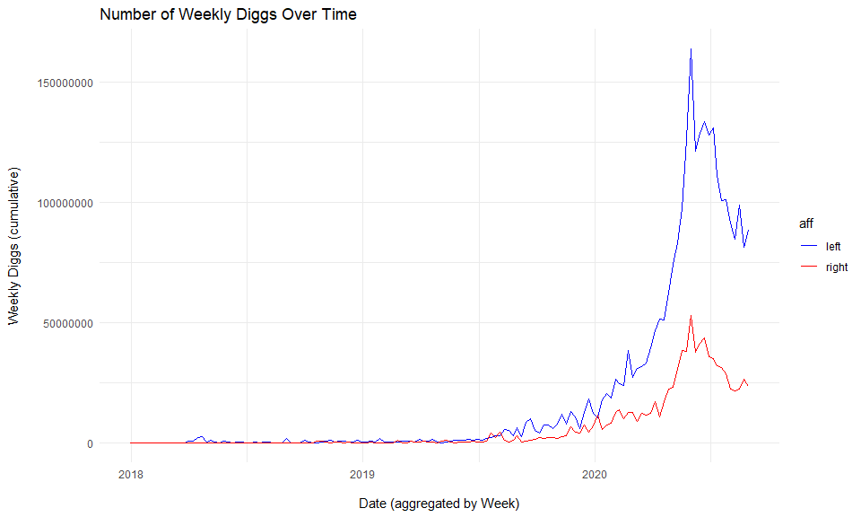
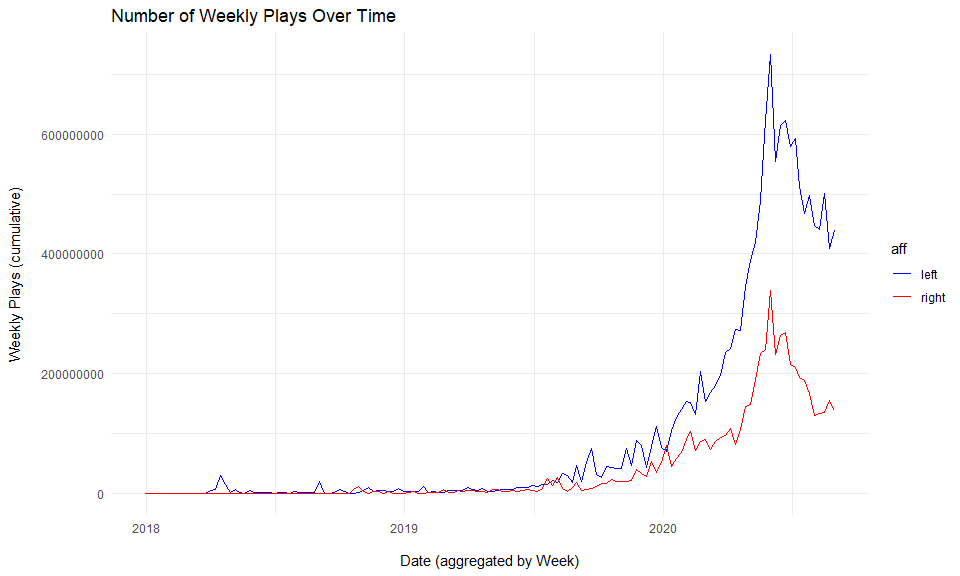
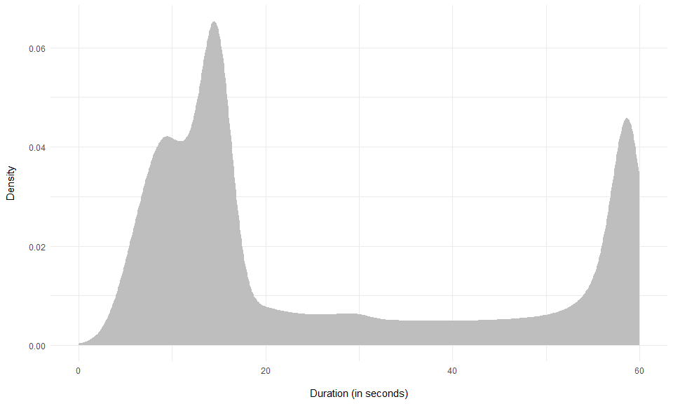

<!-- README.md is generated from README.Rmd. Please edit that file -->

This repo presents the data analysis of the paper…

# Data

# Descriptives

## Number of TikTok posts

``` r
tk_dat %>% nrow
#> [1] 1826308
```

## Number of TikTok posts - left vs. right

``` r
tk_dat %>% count(liberal, sort = T) %>% drop_na() %>% knitr::kable()
```

| liberal |      n |
| ------: | -----: |
|       1 | 963473 |
|       0 | 368548 |

## Number of TikTok accounts

``` r
tk_dat %>% distinct(user_unique_id, .keep_all = T) %>% nrow()
#> [1] 11504
```

## Number of TikTok accounts - left vs. right

``` r
tk_dat %>% distinct(user_unique_id, .keep_all = T) %>% count(liberal, sort = T) %>% drop_na() %>% knitr::kable()
```

| liberal |    n |
| ------: | ---: |
|       1 | 6602 |
|       0 | 2405 |

# Cumulative Stats

## Total TikToks

``` r
tk_dat %>%
  mutate(week = tiktokr::from_unix(date) %>% lubridate::floor_date("week")) %>% 
  mutate(aff = ifelse(liberal == 1, "left", "right")) %>% 
  count(week, aff) %>%
  arrange(aff, week) %>%
  group_by(aff) %>%
  mutate(n = cumsum(n)) %>%
  mutate(week = as.Date(week)) %>%
  drop_na() %>% 
  complete(aff, week = seq.Date(as.Date("2017-12-31"), max(week), by="week")) %>% 
  filter(week >= as.Date("2017-12-31")) %>%
  arrange(aff, week) %>% 
  fill(n, .direction = "down")  %>% 
  mutate(n = ifelse(is.na(n), 0, n)) %>% 
  # filter(week == as.Date("2019-01-06")) %>% 
  # filter(week == as.Date("2020-06-14")) #%>% 
  ggplot(aes(week, n, color = aff)) +
  geom_line() +
  labs(y = "Number of Total Political Tiktoks\n", x = "\nDate (aggregated by Week)", title = "Number of Total Political Tiktoks Over Time") +
  scale_colour_manual(values = c("blue", "red")) +
  theme_minimal()
```

<!-- -->

## Total Diggs

``` r
tk_dat %>%
  mutate(week = tiktokr::from_unix(date) %>% lubridate::floor_date("week")) %>% 
  mutate(aff = ifelse(liberal == 1, "left", "right")) %>% 
  group_by(week, aff) %>%
  summarise_at(vars(contains("n_")), ~sum(.x, na.rm = T))  %>%
  ungroup() %>% 
  mutate(n_digg = as.numeric(n_digg)) %>% 
  group_by(aff) %>%
  mutate(n_digg = cumsum(n_digg))  %>% 
  mutate(week = as.Date(week)) %>%
  drop_na() %>% 
  complete(aff, week = seq.Date(as.Date("2017-12-31"), max(week), by="week")) %>% 
  filter(week >= as.Date("2017-12-31")) %>%
  arrange(aff, week) %>% 
  fill(n_digg, .direction = "down")  %>% 
  mutate(n_digg = ifelse(is.na(n_digg), 0, n_digg)) %>% 
  ggplot(aes(week, n_digg, color = aff)) +
  geom_line() +
  labs(y = "Total Diggs (cumulative)\n", x = "\nDate (aggregated by Week)", title = "Number of Diggs Over Time") +
  scale_colour_manual(values = c("blue", "red")) +
  theme_minimal()
```

<!-- -->

## Total Plays

``` r
tk_dat %>%
  mutate(week = tiktokr::from_unix(date) %>% lubridate::floor_date("week")) %>% 
  mutate(aff = ifelse(liberal == 1, "left", "right")) %>% 
  group_by(week, aff) %>%
  summarise_at(vars(contains("n_")), ~sum(.x, na.rm = T))  %>%
  ungroup() %>% 
  mutate(n_play = as.numeric(n_play)) %>% 
  group_by(aff) %>%
  mutate(n_play = cumsum(n_play))  %>% 
  mutate(week = as.Date(week)) %>%
  drop_na() %>% 
  complete(aff, week = seq.Date(as.Date("2017-12-31"), max(week), by="week")) %>% 
  filter(week >= as.Date("2017-12-31")) %>%
  arrange(aff, week) %>% 
  fill(n_play, .direction = "down")  %>% 
  mutate(n_play = ifelse(is.na(n_play), 0, n_play)) %>% 
  # filter(between(round(n_play), 1000000000-10000, 1000000000+10000))
  ggplot(aes(week, n_play, color = aff)) +
  geom_line() +
  labs(y = "Total Plays (cumulative)\n", x = "\nDate (aggregated by Week)", title = "Number of Plays Over Time") +
  scale_colour_manual(values = c("blue", "red")) +
  theme_minimal()
```

<!-- -->

<!-- ```{r} -->

<!-- ww <- tk_dat %>% -->

<!--   mutate(week = tiktokr::from_unix(date) %>% lubridate::floor_date("week")) %>%  -->

<!--   mutate(aff = ifelse(liberal == 1, "left", "right")) %>%  -->

<!--   count(week) %>%  -->

<!--   # mutate(n_play = as.numeric(n_play)) %>%  -->

<!--   # group_by(aff) %>% -->

<!--   arrange(week) %>%  -->

<!--   mutate(n = cumsum(n))  %>%  -->

<!--   mutate(week = as.Date(week)) %>%  -->

<!--   filter(between(week, as.Date("2019-12-25"), as.Date("2020-01-05"))) -->

<!-- tk_dat %>% -->

<!--   mutate(week = tiktokr::from_unix(date) %>% lubridate::floor_date("week")) %>%  -->

<!--   mutate(aff = ifelse(liberal == 1, "left", "right")) %>%  -->

<!--   count(week) %>%  -->

<!--   # mutate(n_play = as.numeric(n_play)) %>%  -->

<!--   # group_by(aff) %>% -->

<!--   arrange(week) %>%  -->

<!--   mutate(n = cumsum(n))  %>%  -->

<!--   mutate(week = as.Date(week)) %>%  -->

<!--   filter(between(week, as.Date("2020-10-01"), as.Date("2020-10-10"))) -->

<!-- ``` -->

<!-- ```{r} -->

<!-- tk_dat %>% -->

<!--   mutate(week = tiktokr::from_unix(date) %>% lubridate::floor_date("week")) %>%  -->

<!--   mutate(aff = ifelse(liberal == 1, "left", "right")) %>%  -->

<!--   group_by(week) %>% -->

<!--   summarise_at(vars(contains("n_")), ~sum(.x, na.rm = T))  %>% -->

<!--   ungroup() %>% -->

<!--   mutate(n_play = as.numeric(n_play)) %>%  -->

<!--   # group_by(aff) %>% -->

<!--   mutate(n_play = cumsum(n_play)) %>%  -->

<!--   filter(week >= as.Date("2017-12-31")) %>% -->

<!--   # arrange(aff, week) %>%  -->

<!--   fill(n_play, .direction = "down")  %>%  -->

<!--   mutate(n_play = ifelse(is.na(n_play), 0, n_play)) %>%  -->

<!--   pull(n_play) %>% max -->

<!--   filter(between(round(n_play), 1000000000-100000000, 1000000000+100090000)) -->

<!-- ``` -->

<!-- ```{r} -->

<!-- tk_dat %>% -->

<!--   mutate(week = tiktokr::from_unix(date) %>% lubridate::floor_date("week")) %>%  -->

<!--   mutate(aff = ifelse(liberal == 1, "left", "right")) %>%  -->

<!--   group_by(week) %>% -->

<!--   summarise_at(vars(contains("n_")), ~sum(.x, na.rm = T))  %>% -->

<!--   ungroup() %>% -->

<!--   mutate(n_play = as.numeric(n_play)) %>%  -->

<!--   # group_by(aff) %>% -->

<!--   mutate(n_play = cumsum(n_play))  %>%  -->

<!--   mutate(week = as.Date(week)) %>% -->

<!--   drop_na() %>%  -->

<!--   # complete(aff, week = seq.Date(as.Date("2017-12-31"), max(week), by="week")) %>%  -->

<!--   filter(week >= as.Date("2017-12-31")) %>% -->

<!--   # arrange(aff, week) %>%  -->

<!--   fill(n_play, .direction = "down")  %>%  -->

<!--   mutate(n_play = ifelse(is.na(n_play), 0, n_play)) %>%  -->

<!--   filter(between(round(n_play), 1000000000-100000, 1000000000+100000)) -->

<!-- ``` -->

<!-- ```{r} -->

<!-- tk_dat %>% -->

<!--   mutate(week = tiktokr::from_unix(date) %>% lubridate::floor_date("week")) %>%  -->

<!--   mutate(aff = ifelse(liberal == 1, "left", "right")) %>%  -->

<!--   group_by(week) %>% -->

<!--   summarise_at(vars(contains("n_")), ~sum(.x, na.rm = T))  %>% -->

<!--   ungroup() %>% -->

<!--   mutate(n_play = as.numeric(n_play)) %>%  -->

<!--   # group_by(aff) %>% -->

<!--   mutate(n_play = cumsum(n_play))  %>%  -->

<!--   mutate(week = as.Date(week)) %>% -->

<!--   drop_na() %>%  -->

<!--   # complete(aff, week = seq.Date(as.Date("2017-12-31"), max(week), by="week")) %>%  -->

<!--   filter(week >= as.Date("2017-12-31")) %>% -->

<!--   # arrange(aff, week) %>%  -->

<!--   fill(n_play, .direction = "down")  %>%  -->

<!--   mutate(n_play = ifelse(is.na(n_play), 0, n_play)) %>%  -->

<!--   filter(week == as.Date("2020-06-14")) -->

<!-- ``` -->

<!-- ```{r} -->

<!-- tk_dat %>%  -->

<!--   group_by(liberal) %>%  -->

<!--   summarize(median_plays = median(n_play)) -->

<!-- ``` -->

## Total Comments

``` r
tk_dat %>%
  mutate(week = tiktokr::from_unix(date) %>% lubridate::floor_date("week")) %>% 
  mutate(aff = ifelse(liberal == 1, "left", "right")) %>% 
  group_by(week, aff) %>%
  summarise_at(vars(contains("n_")), ~sum(.x, na.rm = T))  %>%
  ungroup() %>% 
  mutate(n_comment = as.numeric(n_comment)) %>% 
  group_by(aff) %>%
  mutate(n_comment = cumsum(n_comment))  %>% 
  mutate(week = as.Date(week)) %>%
  drop_na() %>% 
  complete(aff, week = seq.Date(as.Date("2017-12-31"), max(week), by="week")) %>% 
  filter(week >= as.Date("2017-12-31")) %>%
  arrange(aff, week) %>% 
  fill(n_comment, .direction = "down")  %>% 
  mutate(n_comment = ifelse(is.na(n_comment), 0, n_comment)) %>% 
  ggplot(aes(week, n_comment, color = aff)) +
  geom_line() +
  labs(y = "Total Comments (cumulative)\n", x = "\nDate (aggregated by Week)", title = "Number of Comments Over Time") +
  scale_colour_manual(values = c("blue", "red")) +
  theme_minimal()
```

<!-- -->

# Weekly Stats

## Weekly TikToks

``` r
tk_dat %>%
  mutate(week = tiktokr::from_unix(date) %>% lubridate::floor_date("week")) %>% 
  mutate(aff = ifelse(liberal == 1, "left", "right")) %>% 
  count(week, aff) %>%
  arrange(aff, week) %>%
  group_by(aff) %>%
  # mutate(n = cumsum(n)) %>%
  mutate(week = as.Date(week)) %>%
  drop_na() %>% 
  complete(aff, week = seq.Date(as.Date("2017-12-31"), max(week), by="week")) %>% 
  filter(week >= as.Date("2017-12-31")) %>%
  filter(week <= as.Date("2020-09-01")) %>%
  arrange(aff, week) %>% 
  fill(n, .direction = "down")  %>% 
  mutate(n = ifelse(is.na(n), 0, n)) %>% 
  ggplot(aes(week, n, color = aff)) +
  geom_line() +
  labs(y = "Number of Weekly Political Tiktoks\n", x = "\nDate (aggregated by Week)", title = "Number of Weekly Political Tiktoks Over Time") +
  scale_colour_manual(values = c("blue", "red")) +
  theme_minimal()
```

<!-- -->

## Weekly Diggs

``` r
tk_dat %>%
  mutate(week = tiktokr::from_unix(date) %>% lubridate::floor_date("week")) %>% 
  mutate(aff = ifelse(liberal == 1, "left", "right")) %>% 
  group_by(week, aff) %>%
  summarise_at(vars(contains("n_")), ~sum(.x, na.rm = T))  %>%
  ungroup() %>% 
  mutate(n_digg = as.numeric(n_digg)) %>% 
  group_by(aff) %>%
  # mutate(n_digg = cumsum(n_digg))  %>% 
  mutate(week = as.Date(week)) %>%
  drop_na() %>% 
  complete(aff, week = seq.Date(as.Date("2017-12-31"), max(week), by="week")) %>% 
  filter(week >= as.Date("2017-12-31")) %>%
  arrange(aff, week) %>% 
  fill(n_digg, .direction = "down")  %>% 
  mutate(n_digg = ifelse(is.na(n_digg), 0, n_digg)) %>% 
  ggplot(aes(week, n_digg, color = aff)) +
  geom_line() +
  labs(y = "Weekly Diggs (cumulative)\n", x = "\nDate (aggregated by Week)", title = "Number of Weekly Diggs Over Time") +
  scale_colour_manual(values = c("blue", "red")) +
  theme_minimal()
```

<!-- -->

## Weekly Plays

``` r
tk_dat %>%
  mutate(week = tiktokr::from_unix(date) %>% lubridate::floor_date("week")) %>% 
  mutate(aff = ifelse(liberal == 1, "left", "right")) %>% 
  group_by(week, aff) %>%
  summarise_at(vars(contains("n_")), ~sum(.x, na.rm = T))  %>%
  ungroup() %>% 
  mutate(n_play = as.numeric(n_play)) %>% 
  group_by(aff) %>%
  # mutate(n_play = cumsum(n_play))  %>% 
  mutate(week = as.Date(week)) %>%
  drop_na() %>% 
  complete(aff, week = seq.Date(as.Date("2017-12-31"), max(week), by="week")) %>% 
  filter(week >= as.Date("2017-12-31")) %>%
  arrange(aff, week) %>% 
  fill(n_play, .direction = "down")  %>% 
  mutate(n_play = ifelse(is.na(n_play), 0, n_play)) %>% 
  ggplot(aes(week, n_play, color = aff)) +
  geom_line() +
  labs(y = "Weekly Plays (cumulative)\n", x = "\nDate (aggregated by Week)", title = "Number of Weekly Plays Over Time") +
  scale_colour_manual(values = c("blue", "red")) +
  theme_minimal()
```

<!-- -->

## Weekly Comments

``` r
tk_dat %>%
  mutate(week = tiktokr::from_unix(date) %>% lubridate::floor_date("week")) %>% 
  mutate(aff = ifelse(liberal == 1, "left", "right")) %>% 
  group_by(week, aff) %>%
  summarise_at(vars(contains("n_")), ~sum(.x, na.rm = T))  %>%
  ungroup() %>% 
  mutate(n_comment = as.numeric(n_comment)) %>% 
  group_by(aff) %>%
  # mutate(n_comment = cumsum(n_comment))  %>% 
  mutate(week = as.Date(week)) %>%
  drop_na() %>% 
  complete(aff, week = seq.Date(as.Date("2017-12-31"), max(week), by="week")) %>% 
  filter(week >= as.Date("2017-12-31")) %>%
  arrange(aff, week) %>% 
  fill(n_comment, .direction = "down")  %>% 
  mutate(n_comment = ifelse(is.na(n_comment), 0, n_comment)) %>% 
  ggplot(aes(week, n_comment, color = aff)) +
  geom_line() +
  labs(y = "Weekly Comments (cumulative)\n", x = "\nDate (aggregated by Week)", title = "Number of Weekly Comments Over Time") +
  scale_colour_manual(values = c("blue", "red")) +
  theme_minimal()
```

<!-- -->

# Top TikTok Music

``` r
music_dis <- tk_dat %>%
  mutate(aff = ifelse(liberal == 1, "left", "right")) %>% 
  select(aff, music_id, music_title) %>%
  filter(!str_detect(music_title, "d0")) %>% 
  filter(str_detect(music_title, "original sound|Originalton|Original Sound|sonido original|son origin|som original|oryginalny", negate = T))%>%
  count(music_title, aff, sort = T) %>%
  filter(music_title != "")


music_dis %>%
  mutate(label = music_title, 
         music_title = paste0(music_title, aff)) %>%
  group_by(aff) %>%
  mutate(index = 1:n()) %>%
  ungroup %>%
  filter(index < 30) %>% 
  mutate(label = str_remove(label, "Childish Gambino -") %>% str_trunc(25)) %>%
  mutate(music_title = fct_reorder(music_title, n)) %>% 
  drop_na(aff) %>% 
  # filter(label == "Say So")
  ggplot(aes(x = music_title, y = n, fill = aff)) +
  geom_col(alpha = .65) +
  # facet_wrap(~aff, nrow = 2, scales = "free_x") +
  geom_text(aes(label = label, color = aff, y = n + 7), angle = 0, hjust = 0, size = 3) +
  theme_minimal() +
  theme(axis.text.y = element_blank(), axis.ticks.y = element_blank()) +
  ggthemes::scale_fill_fivethirtyeight() +
  ggthemes::scale_color_fivethirtyeight() +
  labs(y = "Music Frequency", x = "") +
  guides(fill = F, color = F) +
  coord_flip(ylim = c(0, 2500)) +
  facet_wrap(~aff, scales = "free_y")
```

<!-- -->

# Duration

``` r
tk_dat  %>% 
  # mutate(`Politics` = ifelse(liberal == 1, "Left", "Right")) %>% 
  drop_na() %>% 
  ggplot(aes(duration)) +
  geom_density(fill = "grey", color = NA) +
  scale_x_continuous(limits = c(0, 60)) +
  theme_minimal() +
  # scale_fill_manual(values = c("blue", "red")) +
  labs(y = "Density\n", x = "\nDuration (in seconds)") +
  theme(legend.position = "top")
#> Warning: Removed 121 rows containing non-finite values (stat_density).
```

<!-- -->

``` r

ggsave("images/duration.png", width = 8, height = 5)
#> Warning: Removed 121 rows containing non-finite values (stat_density).
```

``` r
tk_dat %>% 
  mutate(duration_1 = between(duration, 5, 20)) %>% 
  # summarize(duration = median(duration, na.rm = T))
  count(duration_1) %>% 
  drop_na() %>% 
  mutate(perc = n/sum(n)*100)
#> # A tibble: 2 x 3
#>   duration_1       n  perc
#>   <lgl>        <int> <dbl>
#> 1 FALSE       767796  42.0
#> 2 TRUE       1058502  58.0
```

<!-- # Cumulative Tiktoks per User   {.tabset .tabset-pills} -->

<!-- ## Distribution -->

<!-- ```{r} -->

<!-- tk_dat %>% -->

<!--   mutate(date = tiktokr::from_unix(date)) %>%  -->

<!--   mutate(aff = ifelse(liberal == 1, "left", "right")) %>%  -->

<!--   mutate(date = lubridate::floor_date(date, "day")) %>% -->

<!--   count(user_unique_id, date, aff, sort = T) %>% -->

<!--   group_by(user_unique_id) %>% -->

<!--   arrange(date) %>% -->

<!--   mutate(cum_post = cumsum(n)) %>% -->

<!--   mutate(date = (as.numeric(date) - as.numeric(min(date)))/60/60/24) %>% -->

<!--   ungroup %>% -->

<!--   drop_na(aff) %>%  -->

<!--   # filter(date > lubridate::dmy("01-01-2019")) %>% -->

<!--   ggplot(aes(x = date, y = cum_post, group = user_unique_id, color = aff)) +  -->

<!--   geom_line(alpha = .4) + -->

<!--    ggthemes::scale_color_fivethirtyeight() + -->

<!--   # geom_smooth(method = "lm", se = F) + -->

<!--   theme_minimal() + -->

<!--   labs(x = "Time since Account Creation (days)", y = "Number of Tiktoks") -->

<!-- ``` -->

<!-- ## Log-Scaled -->

<!-- ```{r} -->

<!-- tk_dat %>% -->

<!--   mutate(date = tiktokr::from_unix(date)) %>%  -->

<!--   mutate(aff = ifelse(liberal == 1, "left", "right")) %>%  -->

<!--   mutate(date = lubridate::floor_date(date, "day")) %>% -->

<!--   count(user_unique_id, date, aff, sort = T) %>% -->

<!--   group_by(user_unique_id) %>% -->

<!--   arrange(date) %>% -->

<!--   mutate(cum_post = cumsum(n)) %>% -->

<!--   ungroup %>% -->

<!--   filter(date > lubridate::dmy("01-01-2018")) %>% -->

<!--   drop_na(aff) %>%  -->

<!--   ggplot(aes(x = date, y = cum_post, group = user_unique_id, color = aff)) +  -->

<!--   geom_line(alpha = .4) + -->

<!--    ggthemes::scale_color_fivethirtyeight() + -->

<!--   # geom_smooth(method = "lm", se = F) + -->

<!--   theme_minimal() + -->

<!--   labs(x = "Time since Account Creation (days)", y = "logged Number of Tiktoks") + -->

<!--   scale_y_log10() -->

<!-- ``` -->

<!-- ## H1: The ratio of views to followers will be high on TikTok. -->

<!-- ```{r} -->

<!-- dt_h1_tk <- tk_dat %>% -->

<!--   distinct(user_unique_id, .keep_all = T) %>% -->

<!--   select(user_unique_id, total_play, n_follower, Platform) %>% -->

<!--   mutate(ratio = total_play/n_follower)  -->

<!-- dt_h1_yt <- yt_dat %>% -->

<!--   distinct(channel_id, .keep_all = T) %>% -->

<!--   select(user_unique_id = channel_id, total_play, n_follower = subscription_count, Platform) %>% -->

<!--   mutate(ratio = total_play/n_follower) -->

<!-- dt_h1 <- dt_h1_tk %>% -->

<!--   bind_rows(dt_h1_yt)  -->

<!-- ``` -->

<!-- ### Original x-scale -->

<!-- ```{r} -->

<!-- w_results <- wilcox.test(ratio ~ Platform, data = dt_h1, paired = F) -->

<!-- median_labs <- dt_h1 %>%  -->

<!--   group_by(Platform) %>%  -->

<!--   summarize(ratio = median(ratio, na.rm = T) %>% round(2)) %>%  -->

<!--   mutate(ratio_label = paste0("Median: ", ratio)) -->

<!-- gg_density <- dt_h1 %>%  -->

<!--   ggplot(aes(x = ratio, fill = Platform)) +  -->

<!--   geom_density(color = NA, alpha = 0.8) + -->

<!--   labs(x = "", y = "Density\n") + -->

<!--   theme_minimal() + -->

<!--   scale_y_continuous(n.breaks = 3) + -->

<!--   theme(legend.position = "none") + -->

<!--   scale_fill_manual(values = custom_colors) + -->

<!--   xlim(0, 4000) -->

<!-- gg_boxplot <- dt_h1 %>%  -->

<!--   ggplot(aes(x= Platform, y = ratio, fill = Platform)) +  -->

<!--   geom_boxplot() + -->

<!--   coord_flip()  + -->

<!--   labs(x = "Platform\n", y = "\nTotal Views to Followers/Subscribers Ratio") + -->

<!--   theme_minimal() + -->

<!--   theme(legend.position = "none") + -->

<!--   geom_signif(comparisons = list(c("YouTube", "TikTok")),  -->

<!--               annotation=get_plabs(w_results$p.value), vjust=-0.5, test = "wilcox.test", test.args = list(paired = F))  + -->

<!--   geom_text(data = median_labs,aes(label = ratio_label), nudge_x = 0.35, nudge_y = 600) + -->

<!--   scale_fill_manual(values = custom_colors) + -->

<!--   ylim(0, 4000) -->

<!-- wrap_plots(gg_density, gg_boxplot, nrow = 2, heights = c(0.66, 0.33)) -->

<!-- ggsave("images/h1_original.png", width = 8, height = 5) -->

<!-- ``` -->

<!-- ### Logged x-scale -->

<!-- ```{r} -->

<!-- w_results <- wilcox.test(log(ratio) ~ Platform, data = dt_h1, paired = F) -->

<!-- # broom::tidy(w_results) -->

<!-- #  -->

<!-- # report::report(w_results) -->

<!-- ggstatsplot::ggbetweenstats( -->

<!--   data = dt_h1 %>% mutate(ratio = log(ratio+1) %>% sjmisc::zap_inf()), -->

<!--   x = Platform, -->

<!--   y = ratio, -->

<!--   type = "np" -->

<!-- ) -->

<!-- # broomExtra::glance(w_results) -->

<!-- #  -->

<!-- # rcompanion::wilcoxonR(x = dt_h1$ratio, g = dt_h1$Platform) -->

<!-- #  -->

<!-- # statsExpressions::expr_t_nonparametric( -->

<!-- #   data = dt_h1, -->

<!-- #   x = Platform, -->

<!-- #   y = ratio, nboot = 1000 -->

<!-- # )  -->

<!-- median_labs <- dt_h1 %>%  -->

<!--   group_by(Platform) %>%  -->

<!--   summarize(ratio = median(ratio, na.rm = T) %>% round(2)) %>%  -->

<!--   mutate(ratio_label = paste0("Median: ", ratio)) -->

<!-- gg_density <- dt_h1 %>%  -->

<!--   ggplot(aes(x = ratio, fill = Platform)) +  -->

<!--   geom_density(color = NA, alpha = 0.8) + -->

<!--   labs(x = "", y = "Density\n") + -->

<!--   theme_minimal() + -->

<!--   scale_y_continuous(n.breaks = 3) + -->

<!--   theme(legend.position = "none") + -->

<!--   scale_fill_manual(values = custom_colors) + -->

<!--   scale_x_log10(limits = c(1, 10000))  -->

<!-- gg_boxplot <- dt_h1 %>%  -->

<!--   ggplot(aes(x= Platform, y = ratio+1, fill = Platform)) +  -->

<!--   geom_boxplot() + -->

<!--   coord_flip()  + -->

<!--   labs(x = "Platform\n", y = "\nTotal Views to Followers/Subscribers Ratio") + -->

<!--   theme_minimal() + -->

<!--   theme(legend.position = "none")+ -->

<!--   scale_fill_manual(values = custom_colors) + -->

<!--   geom_signif(comparisons = list(c("YouTube", "TikTok")), -->

<!--               annotation=get_plabs(w_results$p.value), vjust=-0.65)  + -->

<!--   geom_text(data = median_labs,aes(label = ratio_label), nudge_x = -0.25, nudge_y = 0.85)+ -->

<!--   scale_y_log10(limits = c(1, 10000))  -->

<!-- wrap_plots(gg_density, gg_boxplot, nrow = 2, heights = c(0.66, 0.33)) -->

<!-- ggsave("images/h1_logged.png", width = 8, height = 5) -->

<!-- ``` -->

<!-- ## H2: Among accounts that leave comments, the percentage who also upload videos will be large on TikTok. -->

<!-- ### At least five -->

<!-- ```{r} -->

<!-- dt_h2 %>%  -->

<!--   mutate(at_least_five = n_videos >= 5) %>%  -->

<!--   count(at_least_five, Platform) %>%  -->

<!--   drop_na() %>%  -->

<!--   group_by(Platform) %>%  -->

<!--   mutate(total = sum(n)) %>%  -->

<!--   mutate(perc = round(n/total*100,2)) %>%  -->

<!--   filter(at_least_five) %>%  -->

<!--   knitr::kable() -->

<!-- ``` -->

<!-- ### Excluding zero videos -->

<!-- ```{r} -->

<!-- dt_h2 %>%  -->

<!--   ggplot(aes(x = n_videos, fill = Platform))  +  -->

<!--   geom_density(color = NA, alpha = 0.8) + -->

<!--   labs(x = "Videos produced by Commenters", y = "Density\n") + -->

<!--   theme_minimal() + -->

<!--   scale_y_continuous(n.breaks = 3) + -->

<!--   # theme(legend.position = "none") + -->

<!--   scale_fill_manual(values = custom_colors) + -->

<!--   scale_x_log10() -->

<!-- ggsave("images/h2_excl_zero_logged.png", width = 8, height = 5) -->

<!-- ``` -->

<!-- ### Including zero videos -->

<!-- ```{r} -->

<!-- dt_h2 %>%  -->

<!--   mutate(n_videos = ifelse(is.na(n_videos), 0, n_videos)) %>%  -->

<!--   filter(n_videos < 10)%>% -->

<!--   ggplot(aes(x = n_videos, fill = Platform))  +  -->

<!--   geom_density(color = NA, alpha = 0.8) + -->

<!--   labs(x = "Videos produced by Commenters", y = "Density\n") + -->

<!--   theme_minimal() + -->

<!--   scale_y_continuous(n.breaks = 3) + -->

<!--   # theme(legend.position = "none") + -->

<!--   scale_fill_manual(values = custom_colors)  -->

<!-- ggsave("images/h2_incl_zero_original.png", width = 8, height = 5) -->

<!-- ``` -->

<!-- ## H3: The relationship between followers and mean video views is weaker for TikTok. -->

<!-- ```{r} -->

<!-- dt_h3_tk <- tk_dat %>% -->

<!--   distinct(user_unique_id, .keep_all = T) %>% -->

<!--   select(user_unique_id, mean_play, median_play, n_follower, Platform) -->

<!-- dt_h3_yt <- yt_dat %>% -->

<!--   distinct(channel_id, .keep_all = T) %>% -->

<!--   select(user_unique_id = channel_id, mean_play, median_play, n_follower = subscription_count, Platform)  -->

<!-- dt_h3 <- dt_h3_tk %>% -->

<!--   bind_rows(dt_h3_yt) -->

<!-- ``` -->

<!-- <!-- ### Mean Plays -->

–\>

<!-- <!-- #### Log scaled -->

–\>

<!-- <!-- ```{r} -->

–\> <!-- <!-- dt_h3 %>%  --> –\>
<!-- <!--   ggplot(aes(x = n_follower, y = mean_play, color = Platform)) + -->
–\> <!-- <!--   geom_point2() +  --> –\>
<!-- <!--   geom_smooth(method = "lm", show.legend = F)  + --> –\>
<!-- <!--   scale_x_log10(labels = scales::label_number(), breaks = scales::breaks_log(6)) + -->
–\>
<!-- <!--   scale_y_log10(labels = scales::label_number(), breaks = scales::breaks_log(6)) + -->
–\>
<!-- <!--   stat_cor(show.legend = F, aes(label = paste(paste("R ==", ..r..), get_plabs(..p..),  -->
–\> <!-- <!--                             sep = "~`,`~"))) +  --> –\>
<!-- <!--   labs(x = "\nNumber of Followers/Subscribers", y = "Mean Video Plays\n") + -->
–\> <!-- <!--   theme_minimal() + --> –\>
<!-- <!--   scale_color_manual(values = custom_colors) + --> –\>
<!-- <!--   theme(legend.position = "top") --> –\>

<!-- <!-- ggsave("images/h3_mean_logged.png", width = 8, height = 5) -->

–\>

<!-- <!-- model_res_yt <- lm(log(mean_play) ~ log(n_follower), data = dt_h3 %>% filter(Platform == "YouTube"))  -->

–\>

<!-- <!-- model_res_tk <- lm(log(mean_play) ~ log(n_follower), data = dt_h3 %>% filter(Platform == "TikTok"))  -->

–\>

<!-- <!-- model_res_yt %>% broom::tidy() -->

–\> <!-- <!-- model_res_tk %>% broom::tidy() --> –\>

<!-- <!-- model_res_yt %>% broom::glance() -->

–\> <!-- <!-- model_res_tk %>% broom::glance() --> –\> <!-- <!-- ``` -->
–\>

<!-- <!-- ```{r} -->

–\> <!-- <!-- r1.jk <- cor(log(dt_h3_tk$mean_play),  --> –\>
<!-- <!--              log(dt_h3_tk$n_follower),  --> –\>
<!-- <!--              use = "pairwise.complete.obs") --> –\>
<!-- <!-- n1 <- dt_h3_tk %>% drop_na(mean_play, n_follower) %>% nrow -->
–\>

<!-- <!-- r2.hm <- cor(log(dt_h3_yt$mean_play),  -->

–\> <!-- <!--              log(dt_h3_yt$n_follower),  --> –\>
<!-- <!--              use = "pairwise.complete.obs") --> –\>
<!-- <!-- n2 <- dt_h3_yt %>% drop_na(mean_play, n_follower) %>% nrow -->
–\>

<!-- <!-- cocor.indep.groups(r1.jk, r2.hm, n1, n2, data.name=c("TikTok", "YouTube"), -->

–\>
<!-- <!--       var.labels=c("Mean Video Plays", "Number of Followers", "Mean Video Views", "Number of Subscribers")) -->
–\> <!-- <!-- ``` --> –\>

<!-- ### Median Plays -->

<!-- #### Log scaled -->

<!-- ```{r} -->

<!-- dt_h3 %>%  -->

<!--   ggplot(aes(x = n_follower, y = median_play, color = Platform)) + -->

<!--   geom_point2() +  -->

<!--   geom_smooth(method = "lm", show.legend = F)  + -->

<!--   scale_x_log10(labels = scales::label_number(), breaks = scales::breaks_log(6)) + -->

<!--   scale_y_log10(labels = scales::label_number(), breaks = scales::breaks_log(6)) + -->

<!--   stat_cor(show.legend = F, aes(label = paste(paste("R ==", ..r..), get_plabs(..p..),  -->

<!--                             sep = "~`,`~"))) +  -->

<!--   labs(x = "\nNumber of Followers/Subscribers", y = "Median Video Plays\n") + -->

<!--   theme_minimal() + -->

<!--   scale_color_manual(values = custom_colors) + -->

<!--   theme(legend.position = "top") -->

<!-- ggsave("images/h3_median_logged.png", width = 8, height = 5) -->

<!-- dt_h3_tk_logged <- dt_h3_tk %>%  -->

<!--   mutate(median_play = log(median_play)) %>%  -->

<!--   mutate(n_follower = log(n_follower)) %>%  -->

<!--   sjmisc::zap_inf() %>%  -->

<!--   drop_na(median_play, n_follower) -->

<!-- model_res_yt <- lm(log(median_play) ~ log(n_follower), data = dt_h3 %>% filter(Platform == "YouTube"))  -->

<!-- model_res_tk <- lm(median_play ~ n_follower, data = dt_h3_tk_logged)  -->

<!-- model_res_yt %>% broom::tidy() -->

<!-- model_res_tk %>% broom::tidy() -->

<!-- model_res_yt %>% broom::glance() -->

<!-- model_res_tk %>% broom::glance() -->

<!-- # dt_h3_tk_logged %>%  -->

<!-- #   drop_na(median_play) -->

<!-- ``` -->

<!-- ```{r} -->

<!-- r1.jk <- cor(dt_h3_tk_logged$median_play,  -->

<!--              dt_h3_tk_logged$n_follower,  -->

<!--              use = "pairwise.complete.obs") -->

<!-- n1 <- dt_h3_tk %>% drop_na(median_play, n_follower) %>% nrow -->

<!-- r2.hm <- cor(log(dt_h3_yt$median_play),  -->

<!--              log(dt_h3_yt$n_follower),  -->

<!--              use = "pairwise.complete.obs") -->

<!-- n2 <- dt_h3_yt %>% drop_na(median_play, n_follower) %>% nrow -->

<!-- cocor.indep.groups(r1.jk, r2.hm, n1, n2, data.name=c("TikTok", "YouTube"), -->

<!--       var.labels=c("Median Video Plays", "Number of Followers", "Median Video Views", "Number of Subscribers")) -->

<!-- ``` -->

<!-- ## H4: The variance in viewership across a single accounts' tiktoks will be high. -->

<!-- ```{r} -->

<!-- dt_h4_tk <- tk_dat %>%  -->

<!--   distinct(user_unique_id, .keep_all = T) %>%  -->

<!--   select(mean_play, median_play, sd_play, Platform) %>%  -->

<!--   mutate(sd_play_scaled = scale(sd_play)) -->

<!-- dt_h4_yt <- yt_dat %>%  -->

<!--   distinct(channel_id, .keep_all = T)  %>%  -->

<!--   select(mean_play, median_play, sd_play, Platform) %>%  -->

<!--   mutate(sd_play_scaled = scale(sd_play)) -->

<!-- dt_h4 <- dt_h4_tk %>% -->

<!--   bind_rows(dt_h4_yt)  -->

<!-- # x = mean_play -->

<!-- # y = sd_play -->

<!-- ``` -->

<!-- ### Original scale -->

<!-- ```{r} -->

<!-- w_results <- wilcox.test(sd_play ~ Platform, data = dt_h4) -->

<!-- median_labs <- dt_h4 %>%  -->

<!--   group_by(Platform) %>%  -->

<!--   summarize(sd_play = median(sd_play, na.rm = T) %>% round) %>%  -->

<!--   mutate(sd_play_label = paste0("Median: ", sd_play)) -->

<!-- gg_density <- dt_h4 %>%  -->

<!--   ggplot(aes(x = sd_play, fill = Platform)) +  -->

<!--   geom_density(color = NA, alpha = 0.8) + -->

<!--   labs(x = "", y = "Density\n") + -->

<!--   theme_minimal() + -->

<!--   scale_y_continuous(n.breaks = 3) + -->

<!--   theme(legend.position = "none") + -->

<!--   xlim(0, 150000) + -->

<!--   scale_fill_manual(values = custom_colors) #+ -->

<!--   # scale_x_continuous(labels = scales::label_number(), limits = c(0, 5500000)) -->

<!-- gg_boxplot <- dt_h4 %>%  -->

<!--   ggplot(aes(x= Platform, y = sd_play, fill = Platform)) +  -->

<!--   geom_boxplot() + -->

<!--   coord_flip()  + -->

<!--   labs(x = "Platform\n", y = "\nMedian SD of Video Plays per Account") + -->

<!--   theme_minimal() + -->

<!--   theme(legend.position = "none") + -->

<!--   geom_signif(comparisons = list(c("YouTube", "TikTok")),  -->

<!--               annotation=get_plabs(w_results$p.value), vjust=-0.5, hjust = -100000)  + -->

<!--   ylim(0, 150000) + -->

<!--   geom_text(data = median_labs,aes(label = sd_play_label), nudge_x = 0.35, nudge_y = 50000) + -->

<!--   scale_fill_manual(values = custom_colors)# + -->

<!--   # scale_y_continuous(labels = scales::label_number(), limits = c(0, 5500000)) -->

<!-- w_results -->

<!-- wrap_plots(gg_density, gg_boxplot, nrow = 2, heights = c(0.66, 0.33)) -->

<!-- ggsave("images/h4_original.png", width = 8, height = 5) -->

<!-- ``` -->

<!-- ### Logged scale -->

<!-- ```{r} -->

<!-- gg_density <- dt_h4 %>%  -->

<!--   ggplot(aes(x = sd_play, fill = Platform)) +  -->

<!--   geom_density(color = NA, alpha = 0.8) + -->

<!--   labs(x = "", y = "Density\n") + -->

<!--   theme_minimal() + -->

<!--   scale_y_continuous(n.breaks = 3) + -->

<!--   theme(legend.position = "none") + -->

<!--   scale_fill_manual(values = custom_colors) + -->

<!--   scale_x_log10(labels = scales::label_number(), breaks = scales::breaks_log(6), limits = c(1, 20000000)) -->

<!-- gg_boxplot <- dt_h4 %>%  -->

<!--   ggplot(aes(x= Platform, y = sd_play, fill = Platform)) +  -->

<!--   geom_boxplot() + -->

<!--   coord_flip()  + -->

<!--   labs(x = "Platform\n", y = "\nMedian SD of Video Plays per Account") + -->

<!--   theme_minimal() + -->

<!--   theme(legend.position = "none") + -->

<!--   geom_signif(comparisons = list(c("YouTube", "TikTok")),  -->

<!--               annotation=get_plabs(w_results$p.value), vjust=-0.5)  + -->

<!--   geom_text(data = median_labs,aes(label = sd_play_label), nudge_x = 0.35, nudge_y = 1.5) + -->

<!--   scale_fill_manual(values = custom_colors) + -->

<!--   scale_y_log10(labels = scales::label_number(), breaks = scales::breaks_log(6), limits = c(1, 20000000)) -->

<!-- wrap_plots(gg_density, gg_boxplot, nrow = 2, heights = c(0.66, 0.33)) -->

<!-- ggsave("images/h4_logged.png", width = 8, height = 5) -->

<!-- ggstatsplot::ggbetweenstats( -->

<!--   data = dt_h4 %>% mutate(sd_play = log(sd_play+1) %>% sjmisc::zap_inf()), -->

<!--   x = Platform, -->

<!--   y = sd_play, -->

<!--   type = "np" -->

<!-- ) -->

<!-- w_results <- wilcox.test(log(sd_play+1) ~ Platform, data = dt_h4) -->

<!-- ``` -->

<!-- ## H5: The ratio of viewership for a single accounts' most popular tiktok to their average tiktok viewership will be high. -->

<!-- ```{r} -->

<!-- dt_h5_tk <- tk_dat %>%  -->

<!--   distinct(user_unique_id, .keep_all = T) %>% -->

<!--   select(most_popular, mean_play, median_play, gini_views, n_video, total_play, Platform) %>% -->

<!--   mutate(peak_mean_ratio = most_popular/mean_play) %>% -->

<!--   mutate(peak_median_ratio = most_popular/median_play) -->

<!-- dt_h5_yt <- yt_dat %>%  -->

<!--   distinct(channel_id, .keep_all = T) %>% -->

<!--   select(most_popular, mean_play, median_play,  gini_views, n_video, total_play, Platform) %>% -->

<!--   mutate(peak_mean_ratio = most_popular/mean_play) %>% -->

<!--   mutate(peak_median_ratio = most_popular/median_play) -->

<!-- dt_h5 <- dt_h5_tk %>%  -->

<!--   bind_rows(dt_h5_yt)  -->

<!-- ``` -->

<!-- ### Mean Plays -->

<!-- #### Original scale -->

<!-- ```{r} -->

<!-- w_results <- wilcox.test(peak_mean_ratio ~ Platform, data = dt_h5) -->

<!-- median_labs <- dt_h5 %>%  -->

<!--   group_by(Platform) %>%  -->

<!--   summarize(peak_mean_ratio = median(peak_mean_ratio, na.rm = T) %>% round(2)) %>%  -->

<!--   mutate(peak_mean_ratio_label = paste0("Median: ", peak_mean_ratio)) -->

<!-- gg_density <- dt_h5 %>%  -->

<!--   ggplot(aes(x = peak_mean_ratio, fill = Platform)) +  -->

<!--   geom_density(color = NA, alpha = 0.8) + -->

<!--   labs(x = "", y = "Density\n") + -->

<!--   theme_minimal() + -->

<!--   scale_y_continuous(n.breaks = 3) + -->

<!--   theme(legend.position = "none") + -->

<!--   scale_fill_manual(values = custom_colors) + -->

<!--   xlim(0, 1000) -->

<!-- gg_boxplot <- dt_h5 %>%  -->

<!--   ggplot(aes(x= Platform, y = peak_mean_ratio, fill = Platform)) +  -->

<!--   geom_boxplot() + -->

<!--   coord_flip()  + -->

<!--   labs(x = "Platform\n", y = "\nPeak-Mean Plays Ratio") + -->

<!--   theme_minimal() + -->

<!--   theme(legend.position = "none") + -->

<!--   geom_signif(#comparisons = list(c("YouTube", "TikTok")),  -->

<!--               annotation=get_plabs(w_results$p.value), xmin = 1.05, xmax = 1.95, y = 1000, tip_length = 20)  + -->

<!--   geom_text(data = median_labs,aes(label = peak_mean_ratio_label), nudge_x = 0.3, nudge_y = 130) + -->

<!--   scale_fill_manual(values = custom_colors) + -->

<!--   ylim(0, 1000) -->

<!-- wrap_plots(gg_density, gg_boxplot, nrow = 2, heights = c(0.66, 0.33)) -->

<!-- ggsave("images/h5_peak_mean_ratio.png", width = 8, height = 5) -->

<!-- ``` -->

<!-- #### Log scaled -->

<!-- ```{r} -->

<!-- gg_density <- dt_h5 %>%  -->

<!--   ggplot(aes(x = peak_mean_ratio, fill = Platform)) +  -->

<!--   geom_density(color = NA, alpha = 0.8) + -->

<!--   labs(x = "", y = "Density\n") + -->

<!--   theme_minimal() + -->

<!--   scale_y_continuous(n.breaks = 3) + -->

<!--   scale_x_log10(limits = c(1, 10000)) + -->

<!--   theme(legend.position = "none") + -->

<!--   scale_fill_manual(values = custom_colors)  -->

<!-- gg_boxplot <- dt_h5 %>%  -->

<!--   ggplot(aes(x= Platform, y = peak_mean_ratio, fill = Platform)) +  -->

<!--   geom_boxplot() + -->

<!--   coord_flip()  + -->

<!--   labs(x = "Platform\n", y = "\nPeak-Mean Plays Ratio") + -->

<!--   theme_minimal() + -->

<!--   theme(legend.position = "none") + -->

<!--   geom_signif(comparisons = list(c("YouTube", "TikTok")), -->

<!--               annotation=get_plabs(w_results$p.value))  + -->

<!--   geom_text(data = median_labs,aes(label = peak_mean_ratio_label), nudge_x = 0.3, nudge_y = 1) + -->

<!--   scale_fill_manual(values = custom_colors) + -->

<!--   scale_y_log10(limits = c(1, 10000))  -->

<!-- wrap_plots(gg_density, gg_boxplot, nrow = 2, heights = c(0.66, 0.33)) -->

<!-- ggsave("images/h5_peak_mean_ratio_logged.png", width = 8, height = 5) -->

<!-- ``` -->

<!-- ### Median Plays -->

<!-- #### Original scale -->

<!-- ```{r} -->

<!-- w_results <- wilcox.test(peak_median_ratio ~ Platform, data = dt_h5) -->

<!-- median_labs <- dt_h5 %>%  -->

<!--   group_by(Platform) %>%  -->

<!--   summarize(peak_median_ratio = median(peak_median_ratio, na.rm = T) %>% round(2)) %>%  -->

<!--   mutate(peak_median_ratio_label = paste0("Median: ", peak_median_ratio)) -->

<!-- gg_density <- dt_h5 %>%  -->

<!--   ggplot(aes(x = peak_median_ratio, fill = Platform)) +  -->

<!--   geom_density(color = NA, alpha = 0.8) + -->

<!--   labs(x = "", y = "Density\n") + -->

<!--   theme_minimal() + -->

<!--   scale_y_continuous(n.breaks = 3) + -->

<!--   theme(legend.position = "none") + -->

<!--   scale_fill_manual(values = custom_colors) + -->

<!--   xlim(0, 1000) -->

<!-- gg_boxplot <- dt_h5 %>%  -->

<!--   ggplot(aes(x= Platform, y = peak_median_ratio, fill = Platform)) +  -->

<!--   geom_boxplot() + -->

<!--   coord_flip()  + -->

<!--   labs(x = "Platform\n", y = "\nPeak-Median Plays Ratio") + -->

<!--   theme_minimal() + -->

<!--   theme(legend.position = "none") + -->

<!--   geom_signif(#comparisons = list(c("YouTube", "TikTok")),  -->

<!--               annotation=get_plabs(w_results$p.value), xmin = 1.05, xmax = 1.95, y = 1000, tip_length = 20)  + -->

<!--   geom_text(data = median_labs,aes(label = peak_median_ratio_label), nudge_x = 0.3, nudge_y = 210) + -->

<!--   scale_fill_manual(values = custom_colors)  + -->

<!--   ylim(0, 1000) -->

<!-- wrap_plots(gg_density, gg_boxplot, nrow = 2, heights = c(0.66, 0.33)) -->

<!-- ggsave("images/h5_peak_median_ratio.png", width = 8, height = 5) -->

<!-- ``` -->

<!-- #### Log scaled -->

<!-- ```{r} -->

<!-- w_results <- wilcox.test(log(peak_median_ratio+1) ~ Platform, data = dt_h5) -->

<!-- gg_density <- dt_h5 %>%  -->

<!--   ggplot(aes(x = peak_median_ratio, fill = Platform)) +  -->

<!--   geom_density(color = NA, alpha = 0.8) + -->

<!--   labs(x = "", y = "Density\n") + -->

<!--   theme_minimal() + -->

<!--   scale_y_continuous(n.breaks = 3) + -->

<!--   scale_x_log10(limits = c(1, 500000)) + -->

<!--   theme(legend.position = "none") + -->

<!--   scale_fill_manual(values = custom_colors)  -->

<!-- gg_boxplot <- dt_h5 %>%  -->

<!--   ggplot(aes(x= Platform, y = peak_median_ratio, fill = Platform)) +  -->

<!--   geom_boxplot() + -->

<!--   coord_flip()  + -->

<!--   labs(x = "Platform\n", y = "\nPeak-Median Plays Ratio") + -->

<!--   theme_minimal() + -->

<!--   theme(legend.position = "none") + -->

<!--   geom_signif(comparisons = list(c("YouTube", "TikTok")), -->

<!--                annotation=get_plabs(w_results$p.value))  + -->

<!--   geom_text(data = median_labs,aes(label = peak_median_ratio_label), nudge_x = 0.3, nudge_y = 1.3) + -->

<!--   scale_fill_manual(values = custom_colors) + -->

<!--   scale_y_log10(limits = c(1, 500000))  -->

<!-- wrap_plots(gg_density, gg_boxplot, nrow = 2, heights = c(0.66, 0.33)) -->

<!-- ggsave("images/h5_peak_median_ratio_logged.png", width = 8, height = 5) -->

<!-- ggstatsplot::ggbetweenstats( -->

<!--   data = dt_h5 %>% mutate(peak_median_ratio = log(peak_median_ratio+1) %>% sjmisc::zap_inf()), -->

<!--   x = Platform, -->

<!--   y = peak_median_ratio, -->

<!--   type = "np" -->

<!-- ) -->

<!-- ``` -->

<!-- ### Gini Coefficient -->

<!-- ```{r} -->

<!-- w_results <- wilcox.test(gini_views ~ Platform, data = dt_h5) -->

<!-- median_labs <- dt_h5 %>%  -->

<!--   group_by(Platform) %>%  -->

<!--   summarize(gini_views = median(gini_views, na.rm = T) %>% round(2)) %>%  -->

<!--   mutate(gini_views_label = paste0("Median: ", gini_views)) -->

<!-- gg_density <- dt_h5 %>%  -->

<!--   ggplot(aes(x = gini_views, fill = Platform)) +  -->

<!--   geom_density(color = NA, alpha = 0.8) + -->

<!--   labs(x = "", y = "Density\n") + -->

<!--   theme_minimal() + -->

<!--   scale_y_continuous(n.breaks = 3) + -->

<!--   theme(legend.position = "none") + -->

<!--   scale_fill_manual(values = custom_colors) #+ -->

<!--   # xlim(0, 4000) -->

<!-- gg_boxplot <- dt_h5 %>%  -->

<!--   ggplot(aes(x= Platform, y = gini_views, fill = Platform)) +  -->

<!--   geom_boxplot() + -->

<!--   coord_flip()  + -->

<!--   labs(x = "Platform\n", y = "\nGini Coefficient Views") + -->

<!--   theme_minimal() + -->

<!--   theme(legend.position = "none") + -->

<!--   geom_signif(comparisons = list(c("YouTube", "TikTok")),  -->

<!--               annotation=get_plabs(w_results$p.value), vjust=-0.5)  + -->

<!--   geom_text(data = median_labs,aes(label = gini_views_label), nudge_x = 0.3, nudge_y = -0.3) + -->

<!--   scale_fill_manual(values = custom_colors) #+ -->

<!--   # ylim(0, 4000) -->

<!-- wrap_plots(gg_density, gg_boxplot, nrow = 2, heights = c(0.66, 0.33)) -->

<!-- ggsave("images/h5_gini.png", width = 8, height = 5) -->

<!-- ggstatsplot::ggbetweenstats( -->

<!--   data = dt_h5, -->

<!--   x = Platform, -->

<!--   y = gini_views, -->

<!--   type = "np" -->

<!-- ) -->

<!-- # w_results <- wilcox.test(gini_views ~ Platform, data = dt_h5) -->

<!-- ``` -->

<!-- ## Lorenz Curve -->

<!-- ```{r} -->

<!-- tk_lorenz <- tk_dat %>%  -->

<!--   # count(user_uni) -->

<!--   group_by(user_unique_id) %>%  -->

<!--   arrange(user_unique_id, n_play) %>%  -->

<!--   select(post_id, user_unique_id, n_play, n_video) %>%  -->

<!--   mutate(n_total_play = sum(n_play, na.rm = T)) %>%  -->

<!--   mutate(perc_plays = n_play/n_total_play) %>%  -->

<!--   mutate(sum_perc_plays = cumsum(perc_plays)) %>%  -->

<!--   mutate(id = 1:n()) %>%  -->

<!--   mutate(perc_n= 1/n()) %>%  -->

<!--   mutate(sum_perc_n = cumsum(perc_n))  -->

<!-- tk_lorenz_avg <- tk_lorenz %>%  -->

<!--   ungroup() %>%  -->

<!--   mutate(sum_perc_n_lab = round(sum_perc_n, 2)) %>%  -->

<!--   mutate(sum_perc_plays_lab = round(sum_perc_plays, 2)) %>%  -->

<!--   group_by(sum_perc_n_lab) %>%  -->

<!--   summarise(sum_perc_n = mean(sum_perc_n, na.rm = T), -->

<!--             sum_perc_plays = mean(sum_perc_plays, na.rm = T)) %>%  -->

<!--   drop_na() -->

<!-- gg_tk_lorenz <- tk_lorenz %>%  -->

<!--   ggplot(aes(sum_perc_n, sum_perc_plays)) + -->

<!--   geom_line(alpha = 0.05, aes(group = user_unique_id)) + -->

<!--   geom_line(data = tk_lorenz_avg, color = tk_blue, size = 1.5) + -->

<!--   theme_minimal() + -->

<!--   labs(x = "\nCumulative Share of Videos from Lowest to Highest", -->

<!--        y = "Cumulative Share of Video Plays\n", title = "YouTube") + -->

<!--   scale_y_continuous(label = scales::percent, n.breaks = 6) + -->

<!--   scale_x_continuous(label = scales::percent, n.breaks = 6) + -->

<!--   geom_hline(aes(yintercept = 0.2), linetype = "dashed") -->

<!-- yt_lorenz <- yt_dat %>%  -->

<!--   # count(user_uni) -->

<!--   group_by(channel_id) %>%  -->

<!--   arrange(channel_id, video_view_count) %>%  -->

<!--   select(video_id, user_unique_id = channel_id, video_view_count) %>%  -->

<!--   mutate(n_total_play = sum(video_view_count, na.rm = T)) %>%  -->

<!--   mutate(perc_plays = video_view_count/n_total_play) %>%  -->

<!--   mutate(sum_perc_plays = cumsum(perc_plays)) %>%  -->

<!--   mutate(id = 1:n()) %>%  -->

<!--   mutate(perc_n= 1/n()) %>%  -->

<!--   mutate(sum_perc_n = cumsum(perc_n))  -->

<!-- yt_lorenz_avg <- yt_lorenz %>%  -->

<!--   ungroup() %>%  -->

<!--   mutate(sum_perc_n_lab = round(sum_perc_n, 2)) %>%  -->

<!--   mutate(sum_perc_plays_lab = round(sum_perc_plays, 2)) %>%  -->

<!--   group_by(sum_perc_n_lab) %>%  -->

<!--   summarise(sum_perc_n = mean(sum_perc_n, na.rm = T), -->

<!--             sum_perc_plays = mean(sum_perc_plays, na.rm = T)) %>%  -->

<!--   drop_na() -->

<!-- gg_yt_lorenz <- yt_lorenz %>%  -->

<!--   ggplot(aes(sum_perc_n, sum_perc_plays)) + -->

<!--   geom_line(alpha = 0.05, aes(group = user_unique_id)) + -->

<!--   geom_line(data = tk_lorenz_avg, color = yt_red, size = 1.5) + -->

<!--   theme_minimal() + -->

<!--   labs(x = "\nCumulative Share of Videos from Lowest to Highest", -->

<!--        y = "Cumulative Share of Video Plays\n", title = "YouTube") + -->

<!--   scale_y_continuous(label = scales::percent, n.breaks = 6) + -->

<!--   scale_x_continuous(label = scales::percent, n.breaks = 6) + -->

<!--   geom_hline(aes(yintercept = 0.2), linetype = "dashed") -->

<!-- wrap_plots(gg_tk_lorenz, gg_yt_lorenz, ncol = 2) -->

<!-- ggsave("images/h5_lorenz.png", width = 10, height = 8) -->

<!-- ``` -->

<!-- ```{r} -->

<!-- tk_lorenz_avg %>% -->

<!--   mutate(Platform = "TikTok") %>%  -->

<!--   bind_rows(yt_lorenz_avg%>% -->

<!--   mutate(Platform = "YouTube"))  %>%  -->

<!--   ggplot(aes(sum_perc_n, sum_perc_plays, color = Platform)) + -->

<!--   geom_line() + -->

<!--   theme_minimal() + -->

<!--   labs(x = "\nCumulative Share of Videos from Lowest to Highest", -->

<!--        y = "Cumulative Share of Video Plays\n") + -->

<!--   scale_y_continuous(label = scales::percent, n.breaks = 6, limits = c(0, 1)) + -->

<!--   scale_x_continuous(label = scales::percent, n.breaks = 6) + -->

<!--   # geom_hline(aes(yintercept = 0.2), linetype = "dashed") + -->

<!--   scale_color_manual(values = custom_colors) +  -->

<!--   geom_abline(intercept = 0, slope = 1, linetype = "dashed") -->

<!-- ``` -->

<!-- ```{r} -->

<!-- tk_lorenz_avg %>% -->

<!--   mutate(Platform = "TikTok") %>%  -->

<!--   bind_rows(yt_lorenz_avg%>% -->

<!--   mutate(Platform = "YouTube")) %>%  -->

<!--   filter(sum_perc_n_lab == 0.80) -->

<!-- ``` -->
