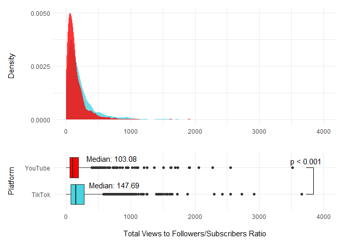

<!-- README.md is generated from README.Rmd. Please edit that file -->

This repo presents the data analysis of the paper…

## Data

``` r
pol <- read_rds(here::here("data/pol_db.rds"))

pol_strict <- pol %>% 
  group_by(user_unique_id) %>%
  filter(mean(political, na.rm = T) > .9) %>%
  mutate(total_play = sum(n_play), 
         most_popular = max(n_play),
         mean_play = mean(n_play), 
         gini_views = DescTools::Gini(n_play)) %>%
  ungroup %>%
  glimpse
#> Rows: 276,761
#> Columns: 32
#> $ post_id        <chr> "6846431122017029382", "6846052504040410374", "68…
#> $ text           <chr> "#greenscreen #fyp #loggers #biden #factsoverfeel…
#> $ date           <int> 1594058967, 1593970813, 1593901753, 1593890762, 1…
#> $ duration       <int> 11, 54, 10, 26, 9, 28, 38, 10, 6, 10, 12, 21, 13,…
#> $ dwnl           <chr> "https://v16m.tiktokcdn.com/71253179e8ae1fca5783b…
#> $ user_id        <chr> "6785246740120781829", "6785246740120781829", "67…
#> $ user_unique_id <chr> "ezekieltheladiesm", "ezekieltheladiesm", "ezekie…
#> $ user_name      <chr> "ezekieltheladiesman", "ezekieltheladiesman", "ez…
#> $ user_signature <chr> "", "", "", "", "", "", "", "", "", "", "", "", "…
#> $ user_link      <chr> NA, NA, NA, NA, NA, NA, NA, NA, NA, NA, NA, NA, N…
#> $ music_id       <chr> "6846431111069846277", "6846052497765829381", "68…
#> $ music_title    <chr> "original sound", "original sound", "original sou…
#> $ n_digg         <int> 14, 12, 7, 24, 25, 27, 5, 11, 9, 46, 21, 12, 17, …
#> $ n_share        <int> 0, 0, 0, 0, 0, 0, 4, 0, 0, 0, 0, 0, 0, 0, 0, 0, 0…
#> $ n_comment      <int> 30, 50, 0, 22, 29, 106, 13, 11, 27, 128, 6, 33, 2…
#> $ n_play         <int> 121, 155, 161, 293, 278, 373, 239, 167, 226, 879,…
#> $ n_following    <int> 126, 126, 126, 126, 126, 126, 126, 126, 126, 126,…
#> $ n_follower     <int> 316, 316, 316, 316, 316, 316, 316, 316, 316, 316,…
#> $ n_heart        <int> 4137, 4137, 4137, 4137, 4137, 4137, 4137, 4137, 4…
#> $ n_user_digg    <int> 6059, 6059, 6059, 6059, 6059, 6059, 6059, 6059, 6…
#> $ n_video        <int> 163, 163, 163, 163, 163, 163, 163, 163, 163, 163,…
#> $ warning        <chr> NA, NA, NA, NA, NA, NA, NA, NA, NA, NA, NA, NA, N…
#> $ query          <chr> "ezekieltheladiesm", "ezekieltheladiesm", "ezekie…
#> $ timestamp      <dbl> 1594131213, 1594131213, 1594131213, 1594131213, 1…
#> $ prob_political <dbl> 0.9712762, 0.9999998, 0.7933978, 0.9987354, 0.998…
#> $ prob_liberal   <dbl> 0.47249514, 0.99890429, 0.80450380, 0.57882190, 0…
#> $ political      <int> 1, 1, NA, 1, 1, 1, 1, 1, NA, 1, NA, 1, 1, 1, NA, …
#> $ liberal        <int> 0, 1, NA, 1, 0, 0, 1, 1, NA, 1, NA, 0, 1, 1, NA, …
#> $ total_play     <int> 49083, 49083, 49083, 49083, 49083, 49083, 49083, …
#> $ most_popular   <int> 2004, 2004, 2004, 2004, 2004, 2004, 2004, 2004, 2…
#> $ mean_play      <dbl> 301.1227, 301.1227, 301.1227, 301.1227, 301.1227,…
#> $ gini_views     <dbl> 0.3810233, 0.3810233, 0.3810233, 0.3810233, 0.381…

options(scipen = 999)

dt_h2 <- read_rds(here::here("data/dt_commenter.rds")) %>%
  glimpse
#> Rows: 103,091
#> Columns: 3
#> $ user_unique_id <chr> NA, "...................okay_", ".............abb…
#> $ n_videos       <int> 3553, 405, 131, 4, 2176, 2, 2, 12, 142, 14, 21, 3…
#> $ n_comment      <int> 23132, 18, 5, 4, 8, NA, 13, NA, NA, 56, NA, NA, N…
```

## H1: The ratio of views to followers will be high on TikTok.

``` r

dt_h1 <- pol_strict %>%
  distinct(user_unique_id, .keep_all = T) %>%
  select(user_unique_id, total_play, n_follower) %>%
  mutate(ratio = total_play/n_follower)

dt_h1 %>%
  ggplot(aes(x = ratio)) + geom_density() + scale_x_log10()
#> Warning: Removed 102 rows containing non-finite values (stat_density).
```

<!-- -->

## H2: Among accounts that leave comments, the percentage who also upload videos will be large on TikTok.

``` r

dt_h2 %>% 
  drop_na %>%
  # filter(n_videos < 400) %>%
  mutate(commenter = n_comment == 0) %>%
  ggplot(aes(x = n_videos)) + geom_density() + scale_x_log10()
```

<!-- -->

## H3: The relationship between followers and mean video views is weaker for TikTok.

``` r

dt_h3 <- pol_strict %>%
  distinct(user_unique_id, .keep_all = T) %>%
  select(user_unique_id, mean_play, n_follower)

dt_h3 %>%
  ggplot(aes(x = n_follower, y = mean_play)) + geom_point() + scale_x_log10() + scale_y_log10()
#> Warning: Removed 102 rows containing missing values (geom_point).
```

<!-- -->

## H4: The variance in viewership across a single accounts’ tiktoks will be high.

``` r

dt_h4 <- pol_strict %>% 
  group_by(user_unique_id) %>%
  summarise(view_sd = sd(n_play))
#> `summarise()` ungrouping output (override with `.groups` argument)

dt_h4 %>%
  ggplot(aes(x = view_sd)) + geom_density() + scale_x_log10()
#> Warning: Removed 103 rows containing non-finite values (stat_density).
```

<!-- -->

## H5: The ratio of viewership for a single accounts’ most popular tiktok to their average tiktok viewership will be high.

``` r
dt_h5 <- pol_strict %>% 
  distinct(user_unique_id, .keep_all = T) %>%
  select(most_popular, mean_play, gini_views, n_video, total_play) %>%
  mutate(peak_ratio = most_popular/mean_play)

  
dt_h5 %>%  ggplot(aes(x = peak_ratio)) + geom_density() + scale_x_log10()
#> Warning: Removed 102 rows containing non-finite values (stat_density).
```

<!-- -->

``` r
dt_h5 %>% ggplot(aes(x = gini_views)) + geom_density()
#> Warning: Removed 103 rows containing non-finite values (stat_density).
```

<!-- -->
